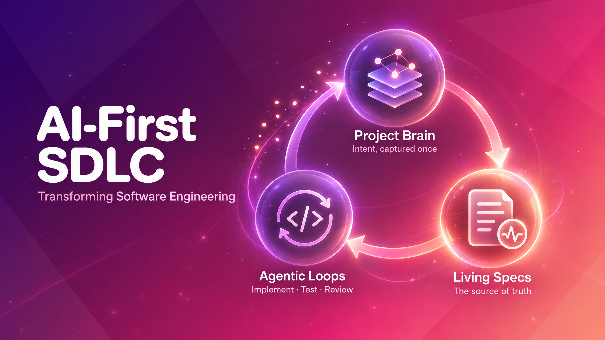

*Software engineering stopped being about writing code. It became about managing context.*

After adopting the AI-First SDLC across 8 of our roughly 12 engineering teams at [Tecknoworks](https://tecknoworks.com), this is the operating model we landed on: what works, what doesn't, and what it took to get teams to adopt it. It builds on the talk I gave at [DevTalks Cluj](https://www.devtalks.ro/cluj#speakers) in September. I was pleasantly surprised by the turnout and by how many people asked for the slides afterwards, so I decided to write this post.

If you write software today, you've already seen AI speed up coding a lot. **But** it hasn't sped up *capturing the intent*, and that work isn't streamlined across the company. Every team still reconstructs what the system does, and what it should do, in its own way, one meeting at a time.

This post covers the SDLC we adopted to fix both problems. It speeds up delivery further, keeps teams and projects consistent, and leaves everyone better aligned and less frustrated.

## Table of contents

## What Has Changed: Implementation Collapsed

Take a traditional sprint. Roughly 30% of it goes to working out the intent (the current state, the future state, and getting the team aligned). Half goes to implementation, writing and changing the code, and the remaining 20% goes to testing, deployment and maintenance.

With AI-accelerated code generation, the implementation and testing slices shrink to about 10% each. That frees up half the sprint. **But the intent-and-alignment slice, still 30%, hasn't moved at all.**

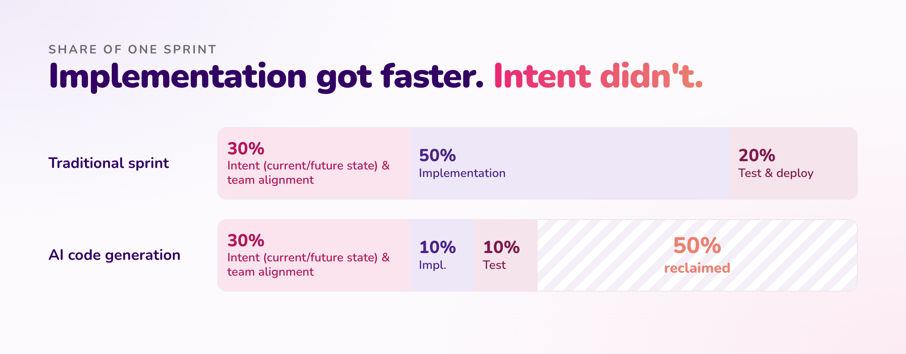

Code generation and requirements capture have to speed up *together*. If requirements stay the bottleneck, they eat into the gains from faster code. Speed up both and the gains compound, because each one reinforces the other.

## Where the Friction Is Now

### What it takes to build something new

This is the mental model that guides the philosophy behind the approach. Every feature moves the product from **the current state** (how it behaves today) to **the future state** (how it should behave once this ships), and the model needs to see both.

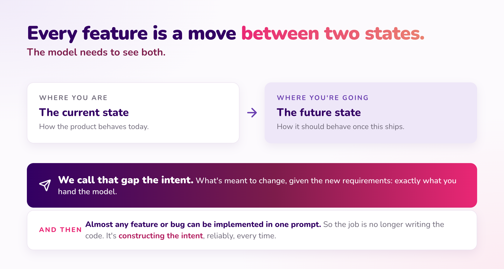

We call the gap between them **the intent**: what's meant to change, given the new requirements. That's exactly what you hand the model.

And then, **almost any feature or bug can be implemented in a single prompt.** So the job is no longer writing the code. It's *constructing the intent*, reliably, every time.

### You can't get the current state from the code

> Code is a **lossy projection** of intent. It records *what* was built, never *why*, what was ruled out, or what constraints shaped it.

- **We keep the output and throw away the thinking.** The AI wrote the code, then we discarded the prompt that explained it.
- **We keep paying for the expensive step.** Every new feature, developer or AI session works out the context from scratch.
- **Nothing compounds.** You get a fast first demo, then the team stalls.

There's also a practical problem. Ask Claude how a feature works in a complex project in three separate sessions and you can get three different answers. That's unreliable, inconsistent and slow. For a simple prototype this doesn't matter, because Claude can read the current state straight from the code quickly and consistently. For complex, long-lived production software with many authors and months of features piling up, "just generate the code" stops scaling.

### A chain of human handoffs

To ship anything, the AI needs the requirements currently running in production and the future state. Today that context is scattered across PMs' heads, Slack and Teams threads, Jira tickets, Confluence pages and meeting notes. So every person pieces it together by hand, meeting after meeting.

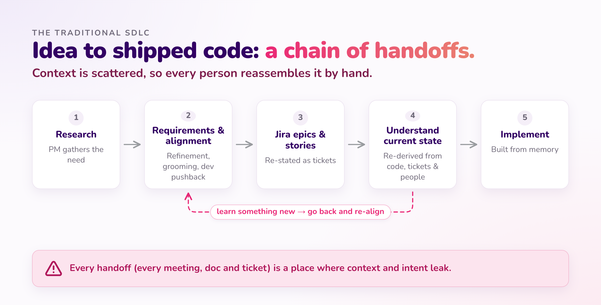

The traditional flow goes like this. You gather requirements, write them up as stories and epics, then start exploring the current state in the codebase. There you find the requirements don't match what's actually there, or the story needs reframing to balance business value against technical debt. So you go back and forth with product or dev to sort it out.

That back-and-forth happens all the time, but it rarely gets written down anywhere that lasts. It lives in people's heads, and sometimes in a Jira ticket that goes stale. Whatever one person discovers, the next person who hits the same problem has to discover again.

### The hidden cost: the intent lives nowhere

The intent isn't defined in one place. It's spread across layers and people. So nobody *reads* the intent. Everyone reconstructs it.

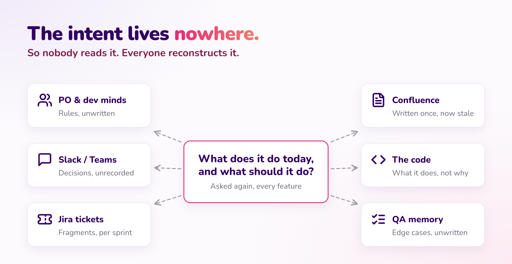

To answer one question (*what does it do today, and what should it do?*) you end up asking the PO what the actual rule is, the ticket what was agreed, the code what it really does, the original developer why it was built this way, QA which edge cases exist, and then everyone again once it changes. No layer owns the intent, so you have to consult every layer. And the answer is only ever as good as the last conversation.

### Nine symptoms of one disease

| Symptom | What it means |
|---|---|
| **No single source of truth** | Nothing trustworthy or stable, and no agreed format for it either. |
| **Requirements archaeology** | The current state has to be dug out of Jira, code and people's memory. |
| **Meetings to align** | Rounds of meetings just to agree on the current and future state. |
| **The telephone game** | Intent passes from person to person and loses fidelity at every hop. |
| **Everyone re-derives** | Context switches, new joiners, lost knowledge. The same work, over again. |
| **Bug or feature?** | Endless debates, because there's no agreed definition to settle them. |
| **Overlapping, misplaced components** | Tangled dependencies and key-person risk, with no clear boundaries. |
| **No auditable trail** | You can't reconstruct what was decided, or why. |
| **Knowledge doesn't compound** | Every feature works out the intent again, and nothing learned is kept. |

Without durable, versioned, well-structured artifacts that define the intent, teams pay an ongoing **rediscovery tax**. They rebuild context through meetings, tribal knowledge, analysis and rework.

## The Approach We Adopted

The **AI-First SDLC** is a way of developing software where a machine-readable spec defines how the system behaves and serves as the single source of truth. The starting point is the same as before. The difference is that alignment now produces a durable spec instead of scattered stories.

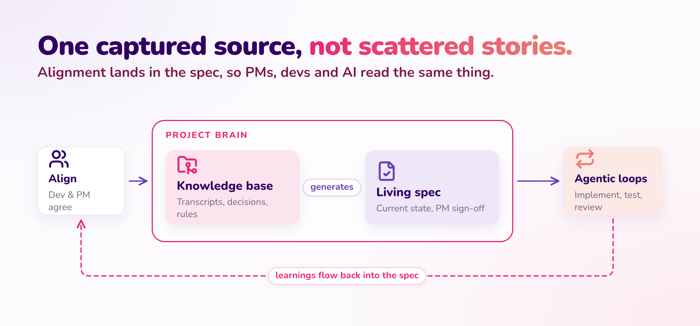

Research and raw project material (transcripts, documentation, decisions, anything relevant) goes into a **Project Brain**. The **Living Specs** are generated from that knowledge base. Once the specs exist, **Agentic Loops** take over. These are repeatable, chained steps that implement, test and review against the spec.

The key change: when you learn something new, you still align with the PM, but the outcome goes back into the spec. It doesn't stay in one person's head or a one-off ticket. The next person who touches that area finds an up-to-date spec instead of working it out again. That's where knowledge starts to compound instead of leaking at every handoff.

### Three pillars, one operating model

This isn't a single technique. It's an end-to-end way of working, and each pillar covers what the others can't.

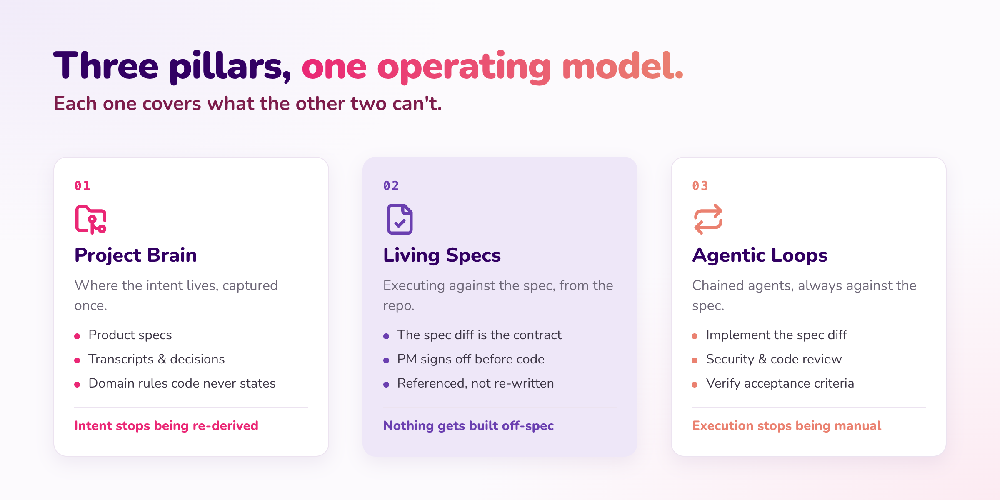


1. **Project Brain:** where the intent lives. It holds the product specs plus the context behind them (transcripts, emails, decisions and their reasons, domain rules the code never states), captured once. *The intent stops being re-derived.*
2. **Living Specs:** the discipline of executing against those specs, referenced from inside the repository. The spec diff is the contract, and the PM signs off the diff before any code is written. *Nothing gets built off-spec.*
3. **Agentic Loops:** chained agents that implement the spec diff, run structure, security and code reviews, and verify against the acceptance criteria. *Execution stops being manual.*

Living Specs are the pillar we know best, but on their own they aren't enough. The Brain is where the specs live, Living Specs are how you execute against them, and the Loops let all of that run without anyone carrying it by hand.

### The Project Brain has three levels of context

Every project has a brain. Who needs to see a piece of context decides where it lives.

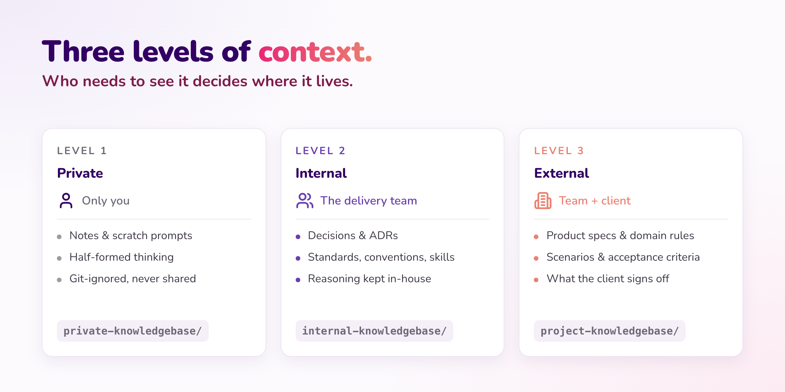

- **Private:** each person's own working context. It's a gitignored folder, never shared or reviewed. It's useful for exploratory prompts you're not ready to share yet, like asking Claude to map the codebase or sketch the architecture in Markdown with Mermaid before you decide it's worth keeping.
- **Internal:** the team level, covering *how we build it*. This is where engineering decisions, ADRs, standards and conventions, reusable Claude skills, and reasoning we don't put in front of the client all live.
- **External:** the full team, client included, covering *what everyone agrees to*. Product specs and domain rules, scenarios and acceptance criteria, client-side transcripts, and anything the client signs off on.

In practice it's one repository per project, with the three levels of context, the living specs and the code side by side:

```text
project-brain/
├─ private-knowledgebase/     PRIVATE  — your own notes and drafts, git-ignored
│   ├─ my-notes.md
│   └─ README.md
├─ internal-knowledgebase/    INTERNAL — team-only: transcripts, decisions, estimates
│   ├─ transcripts/
│   └─ decisions.md
├─ project-knowledgebase/     EXTERNAL — shared with the client: specs, scenarios, ADRs
│   ├─ specs/
│   │   ├─ products.md
│   │   └─ billing.md
│   ├─ scenarios/
│   ├─ adrs/
│   └─ transcripts/
├─ source-code/               the implementation, next to the intent it came from
├─ .gitignore
├─ CLAUDE.md                  how the brain is organised, and the rules the agent follows
└─ README.md
```

A few practical notes:

- **Keep `CLAUDE.md` short**, no more than 100–150 lines. It's loaded into the context of every session, and it shouldn't crowd out attention that belongs on the implementation. It describes how the team works and lists the available skills (e.g. *"to build a new feature, invoke this skill"*).
- **Split it into repos if you need to.** The internal and external knowledge bases can be separate repos, so the client sees only what's meant for them. Keeping the source code next to the specs is simplest, but separating it works too.
- **Non-technical clients** who can't clone a repo can still read the Markdown through a tool like Obsidian.
- **Generate tasks from the specs.** Instead of the epics → stories → tickets hierarchy, we create GitHub issues directly from the specs. `CLAUDE.md` knows about this convention, so it checks whether a task needs to be created before work starts.

### The specs, in four formats

Together they capture the intent. For UI/UX, the code itself is the spec.

| # | Format | What it covers | Lives in |
|---|---|---|---|
| 1 | **Product specs** | Context, glossary, use cases and domain rules, described without implementation details. | `specs/` |
| 2 | **Scenarios** | How the use cases and domain rules work together, covering flows and behavior end to end. This is the definition of done. | `scenarios/` |
| 3 | **Technical specs** | Architecture, standards and the constraints everything else must respect. | `adrs/` |
| 4 | **UI/UX** | The exception: the implementation is the source of truth. | `source-code/`, plus a few core principles |

**Product specs** are deliberately abstract. The glossary matters more than you'd expect, because stakeholders use different words for the same concept, so align the language first. Claude connects the dots on its own from a sparse, well-structured spec.

**Scenarios** are the concrete, behavioral side: think of a manual or end-to-end test case (*"log in as an admin, open this page, verify this list appears"*). You can run one as a manual QA test or feed it into something like Playwright to generate an automated test. We keep scenarios separate from product specs on purpose. Mixing the two was one of our early mistakes.

**Technical specs** hold what Claude can't infer from general knowledge. For example: *"this project uses Clean Architecture, here's where domain entities go, here's where controllers go, here are the boundaries between layers,"* plus any infrastructure constraints.

**UI/UX** gets no separate spec, because a page has no deeper structure than what's visible in its HTML and CSS. Backend logic doesn't get the same treatment. The business logic and modularity behind it can be complex enough that Claude would have to go through far too much context to reconstruct the intent from code alone.

Each spec element is numbered, can be cited, and carries a status. A product spec defines the domain:

```markdown
# Products

## Context
Why this domain exists.

## Glossary
Product · Variant · Price · Catalogue

## Use Cases
### List a product        [built]
### Set pricing           [partial]
### Retire a product      [planned]

## Domain Rules
R1  [built] a product has exactly one owning catalogue
R7  [built] price changes never apply retroactively
R9  [from code — unconfirmed]
R11 [withdrawn — see R14]
```

A scenario proves a rule:

```markdown
### SC-PRODUCTS-014 — A price change does not alter past orders

Covers: R7 · Use case: Set pricing
Status: built · Priority: P1
Setup: sign in as a merchandiser

1. Open the product priced at €40 with one completed order
2. Change its price to €55        → toast: "Price updated"
3. Open the completed order       → still reads €40
4. Return to the catalogue        → shows €55 from now on
```

And an ADR records a decision, including the gap between the decision and what's in the repo:

```markdown
# ADR-014: Event sourcing for Pricing

Status: Accepted · Date: 2026-06-02

## Context
The problem requiring a decision, and the constraints in play.

## Decision
We have decided to [chosen option].

## Rationale
Why this beats the alternatives.

## What isn't built yet
The gap between this and the repo.
```

### Everything flows from the spec

The specs are the single source of truth: product specs for behavior, scenarios for flows, technical specs for architecture. Code, tests, QA cases, docs, task lists and Jira tracking all come after the spec and get regenerated whenever it changes.

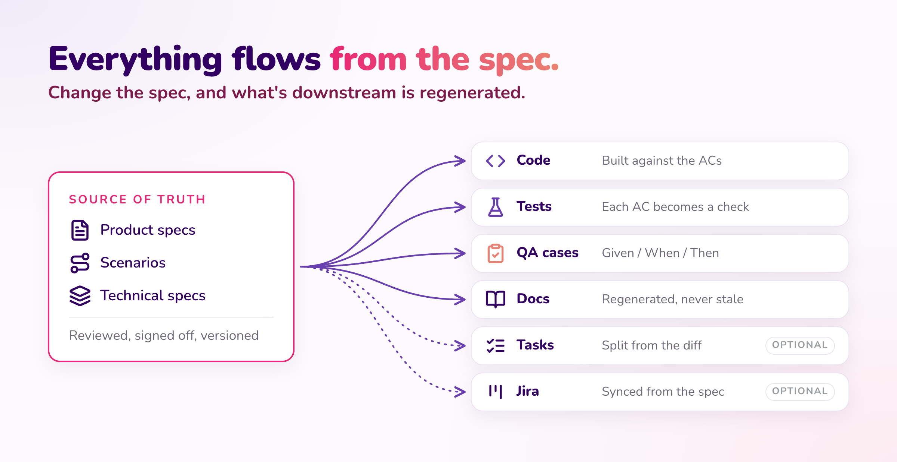

People sometimes object that specs just move the maintenance burden from code to something equally hard to maintain. In our experience they don't. Well-structured natural language is easier to keep in sync than code, which is easy to misread even when it *looks like* it does one thing.

## What It Looks Like in Practice

### The day-to-day loop

This is how you actually hit the three pillars, in order:

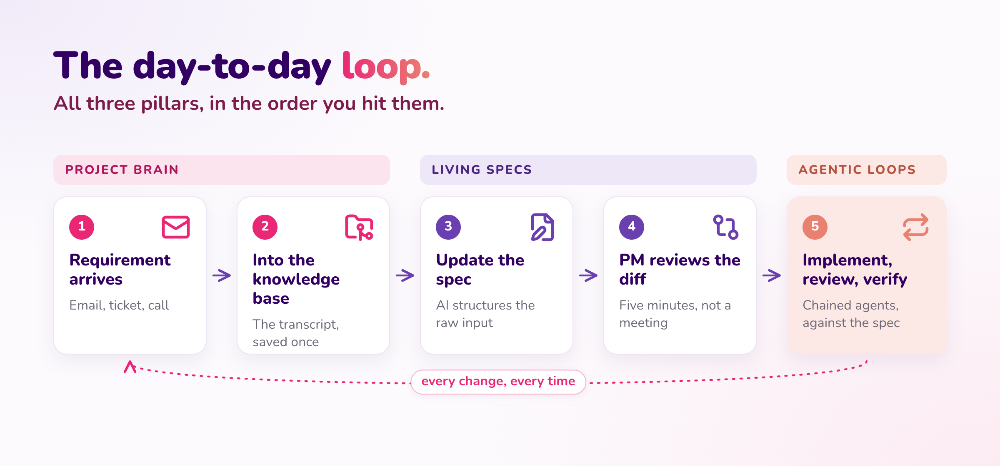

1. **A requirement arrives:** a client email, a ticket, meeting notes, a chat.
2. **It goes into the knowledge base.** Usually whoever was on the call saves the transcript.
3. **The spec gets updated.** Acceptance criteria get stable IDs, and AI helps structure the raw input.
4. **The PM reviews the spec diff** and confirms it captures the intent.
5. **Agentic loops** implement, review and verify against the spec, as a chain.

Here's what it looks like in the terminal after a refinement session, once the transcript has landed in the Project Brain:

```text
claude code — project-northwind

> 1. /sdlc-spec-manager
     Update the specs from this transcript — new/changed
     vocabulary, use cases, domain rules.

  2. Diff the specs
     git diff previous → new spec version. The spec diff is the
     actual contract a PM reviews; a five-minute read, not a meeting.

  3. Review code + infra against the diff
     What technical/project specs need updating or creating —
     new ADRs for anything that changed the "how," not the "what."

  4. Implement
     Plan and implement the diff. Use /project-structure-<stack>
     so new code lands in the right place the first time.

  5. Run guardrails
     /security-review, /bug-hunter, and anything else in the
     pipeline — loop until they pass. This is the step that turns
     a plausible diff into a merged one.
```

Even with good specs, we prefer planning first and then implementing over trying to one-shot it. For parallel work we run several Claude sessions side by side in tmux: one agent per domain, plus dedicated agents for infrastructure, code review and bug hunting. Each one keeps persistent context for its slice of the work and gets reset once it's no longer needed.

A few situations come up again and again:

- **Onboarding someone to a change.** Normally that means an hour-long call plus back-and-forth with the PM, which is another round of the telephone game. Instead, point Claude at the folder. It builds a working mental model of the feature faster and more reliably than a verbal walkthrough, and each person can ask for it in whatever form suits them, such as a Mermaid diagram of the domain.
- **Being blocked on infrastructure you can't provision yourself.** Update the technical spec to note the block and describe a local mock or workaround. The whole team picks it up automatically, with no extra meeting to find out someone already raised the ticket.
- **Specs lagging behind the code.** That's not the end of the world, because you can resync them afterward. A mismatch between spec and code is a fast, visible signal that something is wrong. Without specs, you'd have to piece it together from the code, the project owner's memory and scattered docs just to tell whether something is missing.

### Why bugs drop

A lot of bugs come from Claude making assumptions about a large, unfamiliar module it doesn't have enough context to process fully. The module *looks like* it does one thing but actually does something else. With an always-current picture of the current and future state to work from, most of that ambiguity goes away.

### The human role doesn't disappear

This isn't *"take what the PM says, drop it in a spec, and let Claude run."* The process is: listen to the PM, build your own mental model of what the feature should do and how it connects to the rest of the system, generate the spec, then actually read it back and check it matches the discussion before signing off.

Early on, review carefully. As trust builds, you can give more autonomy to specific parts of the spec. If a generated spec doesn't feel right, tell Claude what's off. It's genuinely good at restructuring information once it knows what the conversation actually established.

Here's a cautionary example from one of our engagements. A PM ran a call transcript through the spec manager alone and handed the developer **500 new lines of spec with no context**. The developer then spent most of their time just working out what had changed. Small, incremental changes are fine to hand off. Big structural changes need the engineer's own understanding of the requirements. **Don't let anyone else fully drive the spec.**

### The golden rule

> **Update the spec before you write the code.**

| Spec first | Code first |
|---|---|
| The intent is agreed before anything is built. The diff is small and reviewable, and a PM can read it. Disagreements come up in minutes, on text. | The spec is already out of date. Now you're reviewing a pull request to guess what was meant, and nobody updates the spec afterwards. |

Don't throw the intent away. It's the most valuable thing you produce. Code can be regenerated, but the reasoning behind it can't. Never discard the prompt that produced a change either: it only compounds if it's captured back into the spec.

## How to Get Started

One project, five steps. Prove it there, then scale it.

1. **Pick a project.** New or existing, one is enough to prove the value.
2. **Create the Project Brain:** the private, internal and project knowledge bases, the code, and a `CLAUDE.md`.
3. **Feed it the context:** docs, transcripts, tickets, emails, everything you already have.
4. **Write specs per domain.** Keep them MECE and do one domain at a time. On existing code, bootstrap the specs and let the PM confirm them.
5. **Implement** against the specs, with the guardrails running.

Name an accountable owner, and keep the brain alive: every learning goes back into the spec.

### It fits wherever your project starts

- **Already on Jira?** It complements Jira, so there's no need to replace it. If stakeholders need Jira, sync it from the specs. The spec stays the source of truth.
- **Legacy project?** Build it up gradually. Start capturing the knowledge base now, and the specs grow domain by domain until it starts compounding.
- **Planning a full migration?** Write the specs before the rebuild. Derive them from the legacy system, align them with the business, prototype, break the result down into specs, and kick off the rebuild once everyone agrees.

### When you don't need it

The structure has a cost, and below a certain size it isn't worth paying.

- **Skip it for prototypes and throwaway work.** You're exploring, not maintaining, so the structure costs more than it saves.
- **Skip it for small codebases.** Claude Code can work out the current state straight from the code, and it does so consistently.
- **Use it for production software that evolves.** With many authors and features piling up for months, the intent no longer fits in anyone's head, or in the code.

It starts paying off around three to six months in, when the intent outgrows what anyone can reconstruct on their own.

## So What?

### Every symptom maps to one part of the AI-First SDLC


| Today | What fixes it | With the AI-First SDLC |
|---|---|---|
| No single source of truth | Living Spec in the Project Brain | One durable, versioned source of truth |
| Requirements archaeology | Living Spec (current state) | You read the current state instead of digging it up |
| Meetings to align | Living Spec + full decision traceability | Far fewer meetings to work out the current state, or what happened before |
| The telephone game | The spec diff as the contract | PMs, devs and AI read the same artifact |
| Everyone re-derives | Living Specs | Read the spec instead of reconstructing it |
| Bug or feature? | The spec | Doesn't match the spec: a bug. Not in the spec: a feature. |
| Overlapping, misplaced components | MECE specs | Clean boundaries, so every component has one home |
| No auditable trail | Versioned specs | The spec history is the decision trail |
| Knowledge doesn't compound | Learnings fed back into the spec | Every round adds to the spec, so knowledge compounds |

And it isn't only faster. The work is more enjoyable, with less of the back-and-forth, misalignment and frustration that come from everyone rebuilding the same picture from a different angle.

### Now the slice that never moved, moves

Back to the sprint we started with. AI on code alone freed up 50% of it. Capturing the intent frees up most of the rest.

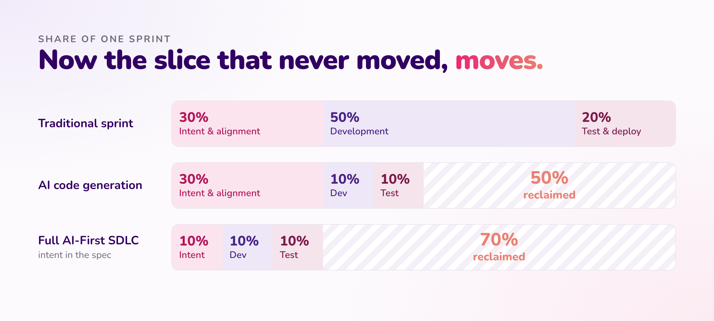

## Lessons Learned

Six things we got wrong first, so you don't have to:

- **Specs must be MECE:** mutually exclusive and collectively exhaustive, split by domain. It's the same principle as bounded contexts in domain-driven design. Overlap is where contradictions breed.
- **Keep specs concise.** Claude Code connects the dots on its own. Over-specifying slows everyone down and ages badly.
- **Let the front-end code be the spec for UI/UX.** Don't describe screens inside specs. Beyond a few core principles, that becomes unmaintainable fast.
- **Don't make the spec complete; make it non-duplicated.** Our first format held flows, UI, test cases and acceptance criteria all in one place. It grew too big to keep in sync, and autonomy dropped. Every duplicated fact is one more thing you have to keep in sync.
- **You can't fully abstract yourself from the code.** Specs are an extra layer of abstraction. You read far less code, and far more deliberately, but you still read it.
- **You need accountable people, properly trained.** Named owners who know the approach, through practical, hands-on workshops, not just a document.

## To Close

AI has already sped up how we build. The real value now is in **how we manage context**.

The AI-First SDLC puts the right structure in place to manage that context and keep it consistent across every team. Does that mean Claude can just take over everything? No. You still have to get your hands on it and build real understanding yourself, not hand it off blind.

**Start with one project. Prove it. Then scale it.**

I also run this as a hands-on workshop for engineering teams, including at a few leading global strategy and management consulting firms. If it would help yours, get in touch.

