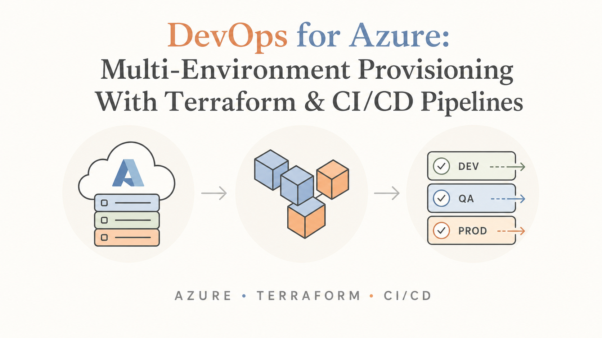
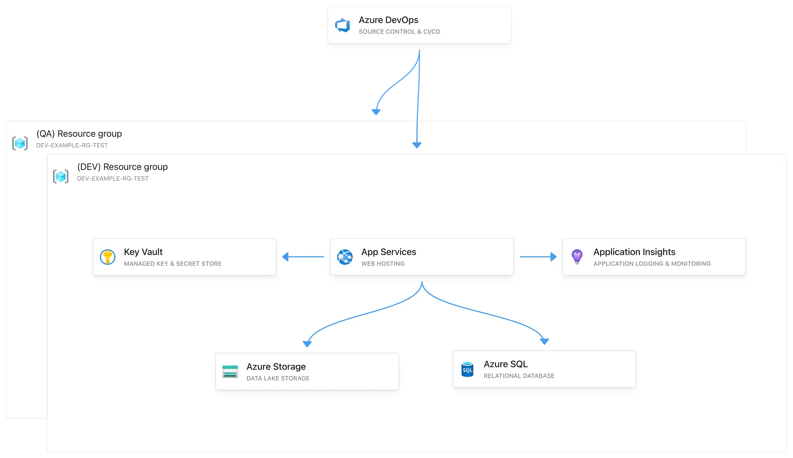

> Originally published on [Medium](https://medium.com/@evgeni.n.rusev/devops-for-azure-multi-environment-provisioning-with-terraform-ci-cd-pipelines-4589a411d986), July 2024.

## Table of contents

## Introduction

In this article, I will provide a step-by-step guide to setting up a multi-environment DevOps solution with CI/CD pipelines and provisioning of Azure resources using Terraform.

[*Link to source code*](https://github.com/evgenirusev/.NET-With-Azure-DevOps-Template)



## Starting with the WHY

As developers we often take on new projects that require a reliable and reusable DevOps solution. Each project necessitates a multi-environment setup (DEV, QA, STG, PROD, etc.), a build and deployment process, as well as basic hosting, storage, and configuration/secrets management solutions.

## Solution

For development operations, **Azure DevOps** can be used due to its seamless integration with Azure and other Microsoft services. For Infrastructure as Code (IaC), **Terraform** is ideal, as it is widely used and offers a cloud-agnostic design. This flexibility is especially beneficial for projects requiring multi-cloud deployments, enabling us to easily extend our IaC scripts to support multiple cloud providers.

## Terraform — Azure Resource Provisioning

### Terraform configuration file

We will begin by creating a Terraform file that defines our infrastructure state and use it to provision our Azure resources. In this example, we will provision the following resources:

- **Service Plan** that hosts a **.NET Web API**
- **Key Vault** for managing our application secrets
- **SQL Server** that hosts an **SQL Database**
- **Storage Account** for Blob storage
- **Application Insights** for logging and monitoring our Web API

```hcl
variable "environment" {
  description = "The environment type for the resources"
  type        = string
  default     = "dev"
}

provider "azurerm" {
  features {}
}

resource "azurerm_resource_group" "example" {
  name     = "${var.environment}-example-rg-test"
  location = "West Europe"
  tags = {
    environment = var.environment
  }
}

resource "azurerm_storage_account" "example" {
  name                     = "${var.environment}examplestoragetest"
  resource_group_name      = azurerm_resource_group.example.name
  location                 = azurerm_resource_group.example.location
  account_tier             = "Standard"
  account_replication_type = "LRS"
  account_kind             = "StorageV2"
  access_tier              = "Hot"
  tags = {
    environment = var.environment
  }
}

resource "azurerm_key_vault" "example" {
  name                = "${var.environment}examplekeyvaulttest"
  location            = azurerm_resource_group.example.location
  resource_group_name = azurerm_resource_group.example.name
  tenant_id           = "6df5d9b1-2807-4c12-a223-63909d98a6f2"
  sku_name            = "standard"
  tags = {
    environment = var.environment
  }
}

resource "azurerm_service_plan" "example" {
  name                = "${var.environment}-service-plan-test"
  location            = azurerm_resource_group.example.location
  resource_group_name = azurerm_resource_group.example.name
  sku_name            = "B1"
  os_type             = "Windows"
  tags = {
    environment = var.environment
  }
}

resource "azurerm_windows_web_app" "example" {
  name                = "${var.environment}-app-service-test"
  resource_group_name = azurerm_resource_group.example.name
  location            = azurerm_service_plan.example.location
  service_plan_id     = azurerm_service_plan.example.id

  app_settings = {
    "APPINSIGHTS_INSTRUMENTATIONKEY" = azurerm_application_insights.example.instrumentation_key
  }

  tags = {
    environment = var.environment
  }

  site_config {}
}

resource "azurerm_application_insights" "example" {
  name                = "${var.environment}-appinsights-test"
  location            = azurerm_resource_group.example.location
  resource_group_name = azurerm_resource_group.example.name
  application_type    = "web"
  tags = {
    environment = var.environment
  }
}

resource "azurerm_mssql_server" "example" {
  name                         = "${var.environment}sqlserver-test"
  resource_group_name          = azurerm_resource_group.example.name
  location                     = azurerm_resource_group.example.location
  version                      = "12.0"
  administrator_login          = "adminuser"
  administrator_login_password = "P@SSW0RD!"
  tags = {
    environment = var.environment
  }
}

resource "azurerm_mssql_database" "example" {
  name      = "${var.environment}db-test"
  server_id = azurerm_mssql_server.example.id
  sku_name  = "Basic"
  tags = {
    environment = var.environment
  }
}
```

At the top of the file, there is a variable that specifies the target environment for provisioning:

```hcl
variable "environment" {
  description = "The environment type for the resources"
  type        = string
  default     = "dev"
}
```

The names of the Azure resources will be determined based on this variable.

**Note:** If your Terraform scripts grow in size, consider splitting them into separate files, each with a clearly defined responsibility.

### Provisioning the resources with Terraform

Prerequisites:

- Terraform and Azure CLI installed on your machine
- An Azure Subscription with Admin access

Start by logging into your Azure account through the Azure CLI:

```bash
az login
```

Once logged in, navigate to your Terraform file, specify an environment that you wish to deploy to in the `environment` variable, and execute the following commands:

```bash
terraform init
terraform plan
```

`terraform plan` is used to preview the changes that will be made by your Terraform configuration. When you run it, Terraform evaluates the current state of your infrastructure and compares it with the desired state defined in your configuration files. It then generates an execution plan, which details the actions Terraform will take to achieve the desired state.

On your initial run of `terraform plan`, you should see the following:


The next step is to run the command that will provision the Azure resources:

```bash
terraform apply
```

After a few minutes, if everything was provisioned successfully, you should receive the following confirmation message:


Next, we can verify that the Azure resources have been successfully provisioned with the specified environment prefix:


## Azure DevOps — Setting up a Development Process and CI/CD Pipelines

### Azure DevOps repos and source code overview

The next step is to upload the [*source code*](https://github.com/evgenirusev/.NET-With-Azure-DevOps-Template) to your repository provider of choice. I'll use Azure DevOps for our example:


Next, let's briefly review the `Program.cs` file, which integrates the Azure services and exposes the Web API. The program connects to our **SQL Database** and **Blob Storage**. This API will expose an endpoint that uses these services:

```csharp
using System.Text;
using Azure;
using Microsoft.EntityFrameworkCore;
using Azure.Storage.Blobs;
using Azure.Storage.Blobs.Models;

var builder = WebApplication.CreateBuilder(args);

// Add appsettings.json
builder.Configuration
    .SetBasePath(Directory.GetCurrentDirectory())
    .AddJsonFile("appsettings.json", optional: false, reloadOnChange: true)
    .AddEnvironmentVariables();

// Configure SQL Database context
var sqlConnectionString = builder.Configuration["SqlDBConnectionString"];
builder.Services.AddDbContext<ExampleDbContext>(options =>
    options.UseSqlServer(sqlConnectionString));

// Configure Azure Blob Service Client
var blobServiceClient = new BlobServiceClient(builder.Configuration["StorageAccountConnectionString"]);
builder.Services.AddSingleton(blobServiceClient);

builder.Services.AddEndpointsApiExplorer();
builder.Services.AddSwaggerGen();

var app = builder.Build();

app.UseSwagger();
app.UseSwaggerUI();

app.UseHttpsRedirection();

app.MapPost("/demo-endpoint", async () =>
    {
        var containerClient = blobServiceClient.GetBlobContainerClient("demo-container");

        // Check if the container exists, if not create it
        try
        {
            await containerClient.CreateIfNotExistsAsync(PublicAccessType.Blob);
        }
        catch (RequestFailedException ex) when (ex.ErrorCode == BlobErrorCode.ContainerAlreadyExists)
        {
            // Container already exists, no need to do anything
        }

        // Create a blob client
        var blobClient = containerClient.GetBlobClient("demo-blob");

        // Upload content to the blob
        var content = "This is a demo content";
        using var stream = new MemoryStream(Encoding.UTF8.GetBytes(content));
        await blobClient.UploadAsync(stream, true);

        // Create a new entity
        var entity = new FileEntity
        {
            FileName = "demo-blob",
            BlobUrl = blobClient.Uri.ToString()
        };

        // Save the entity in the database
        var dbContext = builder.Services.BuildServiceProvider().GetRequiredService<ExampleDbContext>();

        await dbContext.FileEntities.AddAsync(entity);
        await dbContext.SaveChangesAsync();

        return Results.Ok("File created and entity saved successfully.");
    })
    .WithName("CreateFileAndSaveEntity")
    .WithOpenApi();

app.Run();

// DbContext for SQL Database
public class ExampleDbContext : DbContext
{
    public ExampleDbContext(DbContextOptions<ExampleDbContext> options) : base(options)
    {
    }

    public DbSet<FileEntity> FileEntities { get; set; }
}

public class FileEntity
{
    public int Id { get; set; }
    public string FileName { get; set; }
    public string BlobUrl { get; set; }
}
```

### Creating the CI pipelines

The next step is setting up our CI/CD pipelines that will build and deploy our source code to the Azure App Service.

Start by selecting **New pipeline**:


Specify your source code location, and in the Review step, enter your YAML build pipeline code. For this example, I'll use the [*code*](https://github.com/evgenirusev/.NET-With-Azure-DevOps-Template) from our .NET repository:


```yaml
trigger:
  - main

pool:
  vmImage: 'ubuntu-latest'

variables:
  buildConfiguration: 'Release'
  keyVaultName: 'devexamplekeyvaulttest'
  subscriptionConnectionName: 'evgeni test connection'

steps:
  - task: UseDotNet@2
    inputs:
      packageType: 'sdk'
      version: '8.0.x' # Ensure this matches your .NET version
      installationPath: $(Agent.ToolsDirectory)/dotnet

  - task: AzureKeyVault@2
    inputs:
      azureSubscription: $(subscriptionConnectionName)
      KeyVaultName: $(keyVaultName)
      SecretsFilter: '*'
      RunAsPreJob: false

  - task: DotNetCoreCLI@2
    inputs:
      command: 'restore'
      projects: '**/*.csproj'

  - task: DotNetCoreCLI@2
    inputs:
      command: 'build'
      projects: '**/*.csproj'
      arguments: '--configuration $(buildConfiguration)'

  - task: DotNetCoreCLI@2
    inputs:
      command: 'test'
      projects: '**/*.csproj'
      arguments: '--configuration $(buildConfiguration)'

  - task: DotNetCoreCLI@2
    inputs:
      command: 'publish'
      projects: '**/*.csproj'
      arguments: '--configuration $(buildConfiguration) --output $(Build.ArtifactStagingDirectory)'

  - task: PublishBuildArtifacts@1
    inputs:
      pathToPublish: '$(Build.ArtifactStagingDirectory)'
      artifactName: 'example'
```

To enable Azure DevOps to deploy to **Azure App Service**, it must have the necessary access permissions. You can grant this access by creating a **Service Connection** in the **Project Settings**.


Next, specify the names of your **Service Connection** and **Key Vault** within your build pipeline YAML:

```yaml
variables:
  buildConfiguration: 'Release'
  keyVaultName: '{YOUR_KEY_VAULT_NAME}'
  subscriptionConnectionName: '{YOUR_SERVICE_CONNECTION_NAME}'
```

Once saved, the pipeline will automatically run on each new code commit in the specified branch. In this example, it will trigger on the main branch:

```yaml
trigger:
  - main
```

You can also manually run your pipeline if necessary:


On each run, the pipeline will generate an artifact that can be used for deployment.

### Creating the Release/CD pipelines

Release pipelines in Azure DevOps automate the deployment of build artifacts to various environments. They manage the deployment process, including configuration, approvals, and environment-specific settings, ensuring that code changes are reliably and consistently delivered from development through to production.

We can create a new release pipeline by following these steps.

First, create a new release pipeline and specify your trigger and source artifact:


Next, specify the second stage, which can be the deployment to our **Azure App Service**:


**Continuous Deployment (CD)** — If you wish to configure automatic deployments to be triggered once a new artifact is published, you can configure CD by selecting this option on your Artifact trigger:


Our solution can now be deployed to our **Azure App Service**:


### Configuration management — application secrets

Every application requires some form of configuration or secret storage, often managed as environment variables or application secrets. Azure DevOps provides a flexible and robust solution for handling these needs. In our example, we use an **Azure Key Vault** to securely store our secrets.

A common approach to integrating **Key Vault** involves using the SDK for your chosen framework and configuring a service principal in Azure. However, the method we'll be exploring here offers a more streamlined solution by integrating **Key Vault** solely through the Azure DevOps release pipelines. This is achieved using a series of Pipeline tasks that perform file transformations that replace tokens with the Key Vault secrets.

This approach abstracts the Key Vault from your code, providing a cleaner and more maintainable solution.

First, start by specifying your secrets within your `appsettings.json`:

```json
{
    "SqlDBConnectionString": "#{SqlDBConnectionString}#",
    "StorageAccountConnectionString": "#{StorageAccountConnectionString}#"
}
```

Define your secrets within **Azure Key Vault**:


Next, include the **Azure Key Vault** task in your Release pipeline:


Add the **File Transform** task:


Lastly, add the **Replace Tokens** task:


To grant the release pipelines access to read from the **Key Vault**, you need to create an access policy within the **Key Vault**. This policy should permit the Azure DevOps project to **List** and **Get** the secrets:


### Configuration management — application configuration

Additionally, if you have any application configuration that varies based on your environment (DEV, QA, etc.), you can define those configurations within each release pipeline:


### Difference between Build and Release pipelines in Azure DevOps

Azure Pipelines distinguishes between Build and Release pipelines. Build pipelines focus on compiling code, running tests, and producing artifacts (e.g., binaries, packages). Release pipelines, on the other hand, handle the deployment of these artifacts to various environments, managing configuration and approvals as part of the release process.

## Final Result

We now have a solution in place with CI/CD pipelines that publishes our code on each new commit to an **Azure App Service** with configuration management integration with **Azure Key Vault**.

### Testing the solution

After a commit, the build pipeline triggers and generates an artifact:


Our CD release pipeline automatically triggers and deploys the new artifact to **Azure App Service**:


We can confirm that the .NET API has been successfully integrated with our Azure resources:


## Conclusion

In this article, we've set up a multi-environment DevOps solution with CI/CD pipelines using Azure DevOps and Terraform. By following these steps, you can ensure your applications are effectively built, tested, and deployed across multiple environments.

---

If you found this article useful and want to discuss further, feel free to reach out on [LinkedIn](https://www.linkedin.com/in/evgeni-rusev-24636017b/) — happy to chat about Azure infrastructure, IaC patterns, or DevOps in general.
