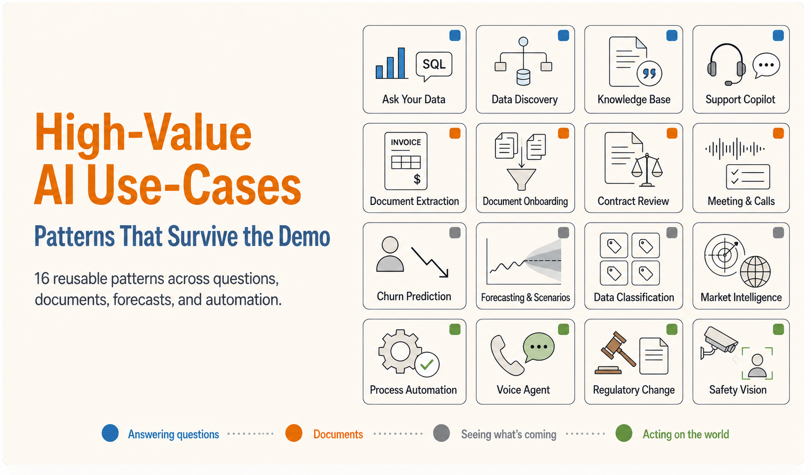

*We evaluate a lot of AI use-cases at [Tecknoworks](https://tecknoworks.com). These are the ones that keep coming up across industries and actually deliver business value once in production — with a short visual demo of each below.*

Across finance, legal, manufacturing, healthcare, and logistics, most use-cases are situational — they solve one company's problem and don't travel far.

The ones below are the exception: the same handful of shapes that recur in industry after industry, which is what makes them worth building. Treat the list as a menu, not a ranking — if one looks like something your team already does by hand, that's where to start.

## Table of contents

## How to Read This List

I've grouped them by what the AI actually *does* — which, more than the industry, decides how hard it is to build and how you keep it trustworthy. The groups climb from least to most autonomous: at the bottom the AI just answers a question; at the top it runs a process end to end or watches a live feed. The higher you go, the more the system has to show its reasoning and keep a person in the loop — the line between something you can run in production and something that only works in a demo.

- **Answering questions** — Ask Your Data, Data Discovery, Knowledge Base, Support Copilot, Market Intelligence
- **Making sense of documents** — Document Extraction, Document-to-Data Onboarding, Contract Review, Meeting & Call Intelligence, Data Classification
- **Seeing what's coming** — Churn Prediction, Forecasting & Scenarios
- **Acting on the world** — Process Automation, Voice Agent, Regulatory Change, Visual AI

## Answering Questions

The safest place to start. These read, retrieve, and answer — they don't change anything in your systems, so they're easy to trust and quick to ship.

### Ask your data

The bottleneck on most reporting isn't the analysis — it's the queue. Every "quick question" for the data team waits behind a sprint, and the dashboards you have only answer the questions someone thought to build last quarter.

This is the one genuinely live model in the set. You ask in plain English — *"which regions grew fastest last quarter?"* — and it writes the SQL, runs it against the real database, and picks a chart for the answer. Nobody built that report in advance; the query didn't exist until you asked.

<video src="/images/posts/ai-opportunities/ask-your-data.mp4" poster="/images/posts/ai-opportunities/ask-your-data-poster.jpg" loop muted playsinline preload="none" aria-label="Ask Your Data — a plain-English question turned into SQL and answered with the right chart, across bar, pie and line charts" style="width:100%;height:auto;aspect-ratio:1400/1174;border-radius:0.5rem;background:#0f172a;"></video>

What makes it safe is that the SQL is right there on screen, and the model can only read from the database, never write to it. An analyst can check the query; the system can look at anything and change nothing. That's what lets you hand it to non-technical staff.

It works on any database you point it at — sales, finance, operations, product. And it's not limited to structured data, either: the same plain-English-to-query approach extends to unstructured sources like documents, transcripts, and logs — SQL just happens to be what this demo runs on.

### Data discovery

A number on a dashboard is only as good as your ability to explain it. When finance or an auditor asks *"where does this figure actually come from?"*, the honest answer is usually half a day of tracing through models, formulas, and queries by hand.

Ask about any datapoint and it works backwards through the data model — finds the measure, the formula behind it, the source tables it draws on — and lays out the full lineage, down to the row-by-row breakdown that rebuilds the number.

<video src="/images/posts/ai-opportunities/data-discovery.mp4" poster="/images/posts/ai-opportunities/data-discovery-poster.jpg" loop muted playsinline preload="none" aria-label="Data Discovery — a metric is traced back through the Fabric data model to its formula, source tables, and a row-by-row breakdown that reconstructs the number to a 99.9% match" style="width:100%;height:auto;aspect-ratio:1400/1080;border-radius:0.5rem;background:#0f172a;"></video>

It shows the actual formula and the source tables, then reconciles its own reconstruction against the reported figure — here, a 99.9% match. The provenance *is* the answer, not a footnote to it.

This one runs on Microsoft Fabric, but the pattern — trace a metric back to its roots — fits any warehouse or BI stack.

### Knowledge base

Your answers already exist. They're just spread across wikis, PDFs, and policy docs nobody can find in the moment. The generic chatbot you tried made it worse: fast, confident, and sometimes wrong, with no way to tell when.

Ask a question here and the answer comes back with its sources attached — numbered citations you click to land on the exact passage in the original document.

<video src="/images/posts/ai-opportunities/assistant-citations.mp4" poster="/images/posts/ai-opportunities/assistant-citations-poster.jpg" loop muted playsinline preload="none" aria-label="Knowledge Base — an answer streams in with inline [1][2] citations, and clicking one highlights the exact source passage" style="width:100%;height:auto;aspect-ratio:1400/586;border-radius:0.5rem;background:#0f172a;"></video>

It pulls the relevant passages first and answers only from those, so every claim traces back to something you can read yourself. For anything where a wrong answer costs you — compliance, policy, support — that's the whole point.

The same setup works over an HR handbook, a compliance library, or a sales drive, and stays current as you add documents.

### Support copilot

Support teams answer the same questions over and over. Senior agents lose their day to tickets that were solved a hundred times, and response times slip because everything sits in one queue.

The copilot reads an incoming ticket, classifies it, finds a cited answer, and drafts the reply. Routine questions it can close on its own; anything unclear goes to a person, with the draft and a summary already attached instead of a blank screen.

<video src="/images/posts/ai-opportunities/support-copilot.mp4" poster="/images/posts/ai-opportunities/support-copilot-poster.jpg" loop muted playsinline preload="none" aria-label="Support Copilot — a ticket is classified, answered from the knowledge base with citations, drafted, and auto-resolved as the deflection rate climbs" style="width:100%;height:auto;aspect-ratio:1400/608;border-radius:0.5rem;background:#0f172a;"></video>

Two things keep it in check: every drafted answer carries its citations, and nothing goes out on a sensitive ticket without a person approving it. The easy tickets get handled; the hard ones reach someone faster, with a head start.

It fits customer support, IT and HR helpdesks, and internal service desks — and deflection rate is the number to watch.

### Market intelligence

Keeping up with your market — competitor moves, regulatory shifts, the industry news that actually matters — is a job that gets done badly in the gaps between real work, if it gets done at all.

Kick it off and a set of agents scan the sources — news, filings, competitor pages, forums — group what they find into signals, score each one for impact, and assemble the weekly brief. Open any insight and it expands into a timeline and the sources behind it; ask a follow-up and it answers from the same material.

<video src="/images/posts/ai-opportunities/market-intelligence.mp4" poster="/images/posts/ai-opportunities/market-intelligence-poster.jpg" loop muted playsinline preload="none" aria-label="Market Intelligence — agents scan sources into a weekly brief; an insight drills into a timeline and sources, and a follow-up question is answered" style="width:100%;height:auto;aspect-ratio:1400/640;border-radius:0.5rem;background:#0f172a;"></video>

Every insight links back to the sources it came from, so a claim is one click from the filing or article that backs it — not an anonymous "the market is shifting."

It fits competitive intelligence, regulatory watch, deal sourcing, and industry research.

## Making Sense of Documents

Now the input gets messier — invoices, contracts, recordings. One thing worth saying up front, because it's the mistake I see most often: **extraction is the easy part.** Pulling text off a page is close to solved. It's the matching, the judgment calls, and the exceptions where these systems earn their keep or fall apart. Watch how each one handles the case it *isn't* sure about.

### Document data extraction

Someone in your company is retyping numbers off a PDF right now. It's slow, error-prone work, and a single mistyped figure can cause problems long after, in a system three steps downstream.

Drop in an invoice, a form, or a lab report, and the fields come off the page into a structured record — each with a confidence score.

<video src="/images/posts/ai-opportunities/document-understanding.mp4" poster="/images/posts/ai-opportunities/document-understanding-poster.jpg" loop muted playsinline preload="none" aria-label="Document Data Extraction — fields on an invoice highlight and populate a structured panel, each with a per-field confidence badge" style="width:100%;height:auto;aspect-ratio:1400/534;border-radius:0.5rem;background:#0f172a;"></video>

The confidence score does the real work. High-confidence fields fill in on their own; low-confidence ones get flagged for a person instead of going in wrong. And every field links back to the exact spot on the page it came from. The job shifts from *typing* to *checking*.

Same thing whether it's invoices, claims, KYC packs, medical records, or résumés.

### Document-to-data onboarding

Extraction pulls fields from one document. Onboarding is the batch version — and it's where most of the real work lives. Bringing on a customer, a vendor, or a case usually means a stack of documents in a dozen formats — emails, PDFs, scans, spreadsheets — that someone reads, cross-checks, and keys in, resolving the spots where two of them disagree.

Drop in the batch and the pipeline runs end to end — ingest, OCR, normalize, reconcile — into one structured record. Where two sources conflict (a contract says $250k, an email says $248k), it flags the field instead of quietly picking one.

<video src="/images/posts/ai-opportunities/legal-onboarding.mp4" poster="/images/posts/ai-opportunities/legal-onboarding-poster.jpg" loop muted playsinline preload="none" aria-label="Document-to-data onboarding — a batch of mixed-format documents is ingested, OCR'd, normalized and reconciled into one structured record, with a conflicting value flagged for review" style="width:100%;height:auto;aspect-ratio:1400/968;border-radius:0.5rem;background:#0f172a;"></video>

Every field traces back to the document it came from, and cross-source conflicts get surfaced for a person rather than settled by a coin flip. The reviewer approves; roughly 40 minutes of keying becomes seconds.

It fits customer and vendor onboarding, KYC, claims intake, and case files — anything that starts with a pile of mixed documents.

### Contract review

Manual first-pass contract review is slow and inconsistent, and it's risky — a non-standard clause slips through, and Legal turns into the bottleneck on deals that should be routine.

Point it at an incoming contract and it checks each clause against your playbook — your positions, your risk tolerance — flagging matches, deviations, and missing terms. Open a deviation and there's a suggested redline waiting.

<video src="/images/posts/ai-opportunities/contract-review.mp4" poster="/images/posts/ai-opportunities/contract-review-poster.jpg" loop muted playsinline preload="none" aria-label="Contract Review — each clause is checked against a playbook, deviations are flagged, and a suggested redline is drafted" style="width:100%;height:auto;aspect-ratio:1400/620;border-radius:0.5rem;background:#0f172a;"></video>

Because the playbook holds *your* standards, the review reflects what your business actually cares about, not a generic idea of fair. It drafts; a lawyer approves. The reading is automated, the judgment stays human.

It runs the same way over procurement contracts, sales agreements, NDAs, and leases.

### Meeting & call intelligence

The follow-up after a call is the part that usually doesn't get done. Notes go unwritten, action items get forgotten, and the CRM falls out of date because updating it is a job nobody enjoys.

This one works from audio. A recording becomes a transcript, and the transcript becomes structure: a summary, action items with owners, flagged risks, and updates written back to the CRM.

<video src="/images/posts/ai-opportunities/meeting-intelligence.mp4" poster="/images/posts/ai-opportunities/meeting-intelligence-poster.jpg" loop muted playsinline preload="none" aria-label="Meeting & Call Intelligence — a call recording becomes a transcript, then a summary with owner-assigned action items, risks, and CRM updates" style="width:100%;height:auto;aspect-ratio:1400/600;border-radius:0.5rem;background:#0f172a;"></video>

The summary isn't the point — anyone can generate a recap. The value is what gets written downstream: the action items and CRM updates that otherwise never get entered. All of it ties back to the transcript, so you can check it.

It fits sales calls, support reviews, interviews, and customer-success check-ins.

### Data classification & mapping

Every company has a heap of messy, inconsistent values — support tags, expense categories, product codes — often in several languages, that have to map onto one clean taxonomy before anyone can trust a report built on them. By hand it's slow, and no two people do it the same way.

Point it at the raw values and it maps each one to a standard category with a confidence score, across languages, flagging the low-confidence ones for review and leaving the rest analytics-ready.

<video src="/images/posts/ai-opportunities/classification.mp4" poster="/images/posts/ai-opportunities/classification-poster.jpg" loop muted playsinline preload="none" aria-label="Data Classification & Mapping — messy multilingual values are mapped onto one standard taxonomy with confidence scores, low-confidence rows flagged for review" style="width:100%;height:auto;aspect-ratio:1400/514;border-radius:0.5rem;background:#0f172a;"></video>

Same idea as extraction: the uncertain rows get flagged for a human instead of guessed at, and every mapping carries its confidence. What comes out the other side is one taxonomy instead of six languages' worth of free text.

It fits support tagging, expense coding, product catalogs, and data-migration cleanup.

## Seeing What's Coming

A different kind of output — not what happened, but what's about to. This is where a black box fails: a prediction about the future that you can't question is one nobody acts on.

### Churn prediction

By the time churn shows up in your numbers, the customer is usually already gone. What teams need is a warning while there's still time to act — and a reason.

The model scores every account, and it shows the reasons behind each score: usage dropping off, a support escalation, a renewal date that came and went. Approve the suggested retention offer and the risk score drops in front of you while the revenue-at-risk total re-counts.

<video src="/images/posts/ai-opportunities/customer-churn.mp4" poster="/images/posts/ai-opportunities/customer-churn-poster.jpg" loop muted playsinline preload="none" aria-label="Customer Churn Prediction — an at-risk subscriber's churn score is explained by ranked driver bars; approving a retention offer drops the risk and re-counts revenue-at-risk" style="width:100%;height:auto;aspect-ratio:1400/580;border-radius:0.5rem;background:#0f172a;"></video>

The reasons are what make it usable. A bare "72% likely to churn" tells you nothing to do; knowing *why* tells you which lever to pull. It's a prediction someone can actually own.

It applies anywhere retention matters — subscriptions, telco, SaaS, B2B accounts.

### Forecasting & scenarios

Planning tends to run on stale spreadsheets and gut feel, with no quick way to ask "what if we change price, or demand, or promo?" — and a single forecast line hides the risk in exactly the moments you're planning for.

Pick a scenario or drag a lever and the forecast redraws live, inside a band that widens or narrows with the assumptions. A target line sits across it with a plain verdict: on track, or short.

<video src="/images/posts/ai-opportunities/forecasting.mp4" poster="/images/posts/ai-opportunities/forecasting-poster.jpg" loop muted playsinline preload="none" aria-label="Forecasting & Scenarios — switching scenarios and levers redraws the forecast line, confidence band, and target verdict live" style="width:100%;height:auto;aspect-ratio:1400/530;border-radius:0.5rem;background:#0f172a;"></video>

The band is the honest bit — it shows a range instead of pretending the future is one number. With a baseline and a target next to it, the chart stops being decoration and becomes a decision.

Same engine for demand, revenue, staffing, or cash flow.

## Acting on the World

The top of the ladder. These don't just answer or predict — they *do* something, changing the state of a system or flagging an event as it happens. That's exactly why the audit trail and the human-in-the-loop stop being optional here.

### Process automation

This is the highest-value use-case on the list, and the hardest to get right. High-volume back-office work — invoices, claims, orders — ties up skilled people on tasks that are mostly mechanical and completely repetitive.

Run one through and the system handles the whole chain: capture, match, validate, code, post. A clean item goes straight through to the ERP, payment scheduled, untouched. An unclear one stops and goes to a person, with everything it already worked out attached.

<video src="/images/posts/ai-opportunities/process-automation.mp4" poster="/images/posts/ai-opportunities/process-automation-poster.jpg" loop muted playsinline preload="none" aria-label="Process Automation — an invoice clears end-to-end (capture, post to ERP, schedule payment) with only exceptions routed to a person" style="width:100%;height:auto;aspect-ratio:1400/596;border-radius:0.5rem;background:#0f172a;"></video>

Every step is logged, so you can reconstruct any run after the fact. Straight-through on the routine path, people on the real exceptions — that's what gets a process to somewhere around 80% hands-off. You start with one process, measure how much runs untouched, and expand from there.

Accounts payable and receivable, claims, order handling, reconciliation — same pattern.

### Voice agent

Phone lines are expensive and unforgiving. Callers wait on hold, simple requests — booking, rescheduling, checking status — tie up staff, and after hours nobody picks up at all.

The agent takes the call, holds an actual conversation, and finishes the task — here, finding the caller in the system and booking an appointment — then confirms it by text. The transcript runs live, and the call ends with a booked outcome instead of "we'll get back to you."

<video src="/images/posts/ai-opportunities/voice-agent.mp4" poster="/images/posts/ai-opportunities/voice-agent-poster.jpg" loop muted playsinline preload="none" aria-label="Voice Agent — an inbound call is handled end to end with a live transcript, ending in a booked appointment and a text confirmation" style="width:100%;height:auto;aspect-ratio:1400/526;border-radius:0.5rem;background:#0f172a;"></video>

It handles the routine calls on its own and hands off to a person the moment one goes outside its lane. Every call is transcribed, so there's a record of exactly what was said and agreed.

It fits appointment booking, order status, reservations, tier-1 support, and after-hours cover.

### Regulatory change management

When a regulation changes, the work is large and mostly invisible: figure out which policies, SOPs, products, and training the change touches, draft the updates, and get them to the right owners. Miss a corner and it turns up in an audit.

Feed it a change and it maps the impact — which documents are affected and what has to move — drafts the clause-level redlines, traces the knock-on effects to products and training, and routes each update to its owner. Open a proposed change and you get a before/after redline next to the specific rule it's answering.

<video src="/images/posts/ai-opportunities/regulatory-change.mp4" poster="/images/posts/ai-opportunities/regulatory-change-poster.jpg" loop muted playsinline preload="none" aria-label="Regulatory Change Management — a rule change is assessed for impact across documents, products and training, with a before/after redline drafted and routed to an owner" style="width:100%;height:auto;aspect-ratio:1400/660;border-radius:0.5rem;background:#0f172a;"></video>

Every proposed edit shows the before, the after, and the article driving it — and nothing is applied on its own; an owner signs off on each one.

It fits financial regulation, medical-device and pharma compliance, and data-privacy law — any regulated industry with a paper trail.

### Visual AI

A lot of work still comes down to someone looking at something — a camera feed, a part coming off the line, a shelf, a site — and catching what's off. People can't watch everything at once, so problems get spotted late, if at all, and there's rarely a clean record of what happened.

Point a model at the same feed and it watches every frame. The demo below is a safety example — a live site feed with detection boxes on each worker; the moment someone steps into a restricted zone without a hard hat, an alert fires, as it happens rather than on tomorrow's review.

<video src="/images/posts/ai-opportunities/safety-vision.mp4" poster="/images/posts/ai-opportunities/safety-vision-poster.jpg" loop muted playsinline preload="none" aria-label="Visual AI — a live camera boxes each worker's PPE and fires an alert when a hard hat is missing, dropping the compliance gauge" style="width:100%;height:auto;aspect-ratio:1400/520;border-radius:0.5rem;background:#0f172a;"></video>

Every detection is timestamped and logged on its own, which turns "someone should have been watching" into an actual record. And it runs on the cameras and images you already have.

Safety is just one use. The same core — detect, classify, and flag what matters in an image or video — covers quality inspection on a production line, stock and shelf monitoring in retail, damage assessment for insurance claims, occupancy and queue counting, and vehicle or plate detection.

## The Pattern Underneath

Read them together and the same structure shows up in all of them. Sixteen looks like a lot, but they aren't sixteen separate tools — they're a few of the same building blocks, aimed at different problems.

Each one reads messy input, turns it into something structured, makes a limited decision, and sends the exceptions to a person. And each one that's ready for production shows its reasoning — the SQL, the citation, the confidence score, the reason, the log — because that's what lets someone trust it enough to act on.

So the useful question isn't *"does AI work in my industry?"* Asked that way, it never really resolves. The better one is *"which of these matches the workflow that's costing me the most right now?"* That question has an answer, and the answer points at a build.

One caveat, stated plainly: the demo is never the hard part. The value — and the work — is in everything around it: the integration with your real systems, the confidence thresholds, the approval steps, the audit trail. And the piece that's easiest to underrate is the UI/UX — the human-review gates especially. Design them badly and you've just moved the bottleneck from doing the work by hand to reviewing the AI's output, which can be every bit as slow; design them well and the review is a quick confirm, not a second full-time job. A demo shows you the engine runs. Getting a team to actually go *faster* with it in production is the real job.

## Where to Start

If one or two of these sound like a problem you already have, start there.

Take your two or three most painful workflows — the ones that eat a real chunk of someone's week — and compare them to the list. Something reads messy input, makes a limited call, and passes on what it isn't sure about. If that fits, one of these already does most of the job.

This is the work we do at Tecknoworks, and a short conversation is usually enough to tell whether a use-case is a real build or just a good-looking demo. If you want to talk one through, find me on [LinkedIn](https://www.linkedin.com/in/evgeni-rusev-24636017b/) — tell me which one matched.

