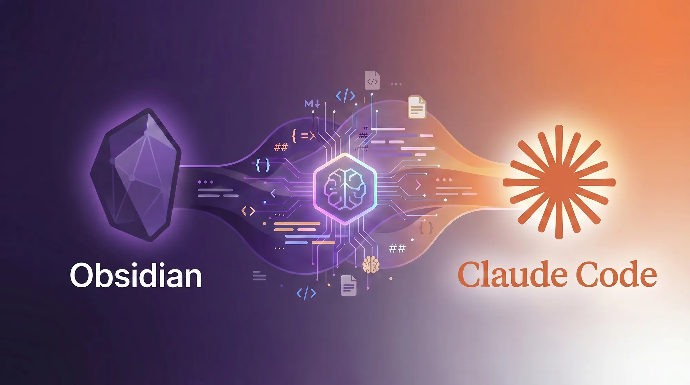
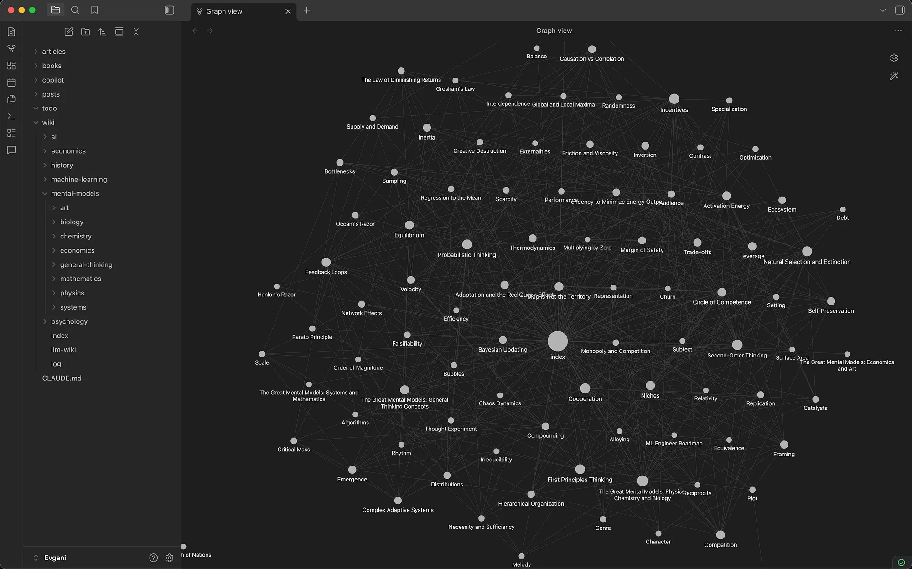

> Originally published on [Medium](https://medium.com/@evgeni.n.rusev/how-i-built-my-second-brain-with-obsidian-claude-code-9fb54b7665ca), April 2026.



*A practical guide to building an AI-native personal knowledge base that reads, structures, and connects ideas for you.*

## Table of contents

## The Problem

For almost a decade, I've been building a personal knowledge base in Notion. I like to read broadly — books and articles across AI, decision-making, economics, history, and more. I take notes, tag them, cross-reference them, draw parallels between disciplines, and distill everything into practical mental models I can apply at work and in life.

**I did all of this in Notion. Manually.**

It worked. But it was slow. Every book or article required thorough structuring — creating pages, nesting sub-pages, applying tags, writing summaries, linking related concepts. And the maintenance never stopped. Tags drifted. Links broke. The hierarchy became hard to manage. The system demanded constant deliberate effort just to keep it usable.

I kept thinking: ***there has to be a better way to do this.***

Then I came across [**Andrej Karpathy's LLM Wiki**](https://gist.github.com/karpathy/442a6bf555914893e9891c11519de94f), and something clicked.

## The Revelation

Karpathy's idea is simple: use an LLM to maintain a wiki. Feed it raw information, give it a schema to follow, and let it do the structuring.

I realized that every workflow I had in Notion — ingesting sources, creating summaries, tagging, cross-referencing, synthesizing principles — Claude Code could do. Not just do, but do 5–10x faster and better. And in an AI-native format: plain markdown files.

This last part matters more than it sounds. Markdown files are:

- **Portable.** No vendor lock-in. Move them anywhere.
- **Composable.** Tags, frontmatter, wikilinks — all of it is just text that any tool can parse.
- **LLM-native.** Claude reads and writes `.md` natively — no API wrappers, no plugins, no export steps. It can structure raw text into tagged pages, extract key insights, and represent the same knowledge as summaries, wiki entries, comparison tables, or any format you need.

The combination of Obsidian (for browsing and visualizing the knowledge graph) and Claude Code (for ingesting, structuring, and querying) turned out to be incredibly effective.

## What My System Looks Like

Here's the structure:

```text
books/                     # One .md file per book
articles/                  # One .md file per article
posts/                     # Written output (like this article)
wiki/
  mental-models/           # Wiki pages by domain
  economics/
  psychology/
  history/
  ai/
  index.md                 # Master catalog — updated on every ingest
  log.md                   # Chronological record of all operations
CLAUDE.md                  # The schema — Claude's "operating manual"
```

Each source file contains YAML frontmatter (tags, author, related links) followed by a summary section, then the full text. Each wiki page is a standalone concept — one idea, one file — with cross-references via `[[wikilinks]]`.

This is what it looks like in Obsidian's graph view after ingesting notes from just four books:



Obsidian graph view shows interconnected concepts. Every node is a standalone markdown file. Every line is a `[[wikilink]]` connecting two ideas. The book nodes sit near the center, radiating outward to 86 mental model pages Claude created across eight domains — physics, chemistry, biology, economics, mathematics, systems thinking, and general thinking. You can see how concepts from different chapters — and even different sources — cluster together naturally.

The graph isn't just pretty — it's functional. Click any node and you land on a structured wiki page with a definition, key principles, examples, and 2–3 carefully chosen connections to related concepts. The cross-disciplinary connections — chemistry to physics to biology — emerge because Claude works with all the content at once and the schema enforces selective linking.

**There's real value in the connections between disciplines.** Most problems we face — at work, in leadership, in life — don't fit neatly into one field. The best solutions often come from borrowing ideas across domains. This structure makes that easy. Every time you add a new source, Claude connects it to everything already in the vault. Obsidian's graph makes those connections visible and navigable.

As more books and articles get ingested, this graph grows organically. New nodes attach to existing ones, and the density of connections increases. The 10th source is more valuable than the 1st because there's more to connect to.

## How It Works in Practice

The workflow is simple but flexible. You bring in new content — a book, an article, a post — and then you guide Claude on what to do with it.

1. I drop the source text into the appropriate folder.
2. I tell Claude what I want: *"Read this and create wiki pages for the main concepts. Link them to existing pages where relevant."*
3. Claude does the heavy lifting — reading, summarizing, creating structured pages, cross-referencing — but I'm directing the process. I might say *"focus on the decision-making frameworks,"* or *"connect this to what we have on incentives,"* or *"this needs its own wiki section."*

The key is that **you're still in control.** Claude doesn't just auto-process everything the same way. You decide what's worth extracting, how deep to go, and what connections matter. Sometimes I ingest a full book and ask for 15 wiki pages. Other times I clip an article and just want one concept added to an existing page.

What used to take me hours in Notion — reading, summarizing, structuring, tagging, linking — now takes minutes. And the output is *better*. Claude catches connections I would have missed. It maintains consistent structure across hundreds of pages without fatigue. It doesn't forget to update the index.

## The Schema File: CLAUDE.md

The whole system can work seamlessly because of one file: `CLAUDE.md`.

When Claude Code opens a project, the first thing it does is read `CLAUDE.md` from the root directory. This file is Claude's instruction manual — it tells every new session exactly how the knowledge base is structured, what conventions to follow, and what's available.

This means I never have to re-explain the system. Every time I start a new Claude Code session, it already knows:

- The directory structure — where books, articles, wiki pages, and logs live
- The tagging conventions — content-type tags (`mental-model`, `framework`, `note`, `guide`) and domain tags (`psychology`, `economics`, `leadership`), lowercase kebab-case, added organically
- The page templates — what a wiki page should look like (one-line definition, core idea, key principles, examples, connections, source)
- The frontmatter format — standardized YAML metadata on every page
- The linking rules — how many cross-references to make and how selective to be

Here's what the frontmatter looks like on a typical wiki page:

```yaml
---
tags: [mental-model, biology]
source: "The Great Mental Models Vol 2"
author: "Shane Parrish"
date_ingested: 2026-04-22
related:
  - "[[Natural Selection and Extinction]]"
  - "[[Ecosystem]]"
---
```

The key insight: **the schema file turns Claude from a general-purpose assistant into a domain-specific knowledge worker.** Without it, you'd spend the first five minutes of every session explaining your system. With it, Claude already has the full context — the structure, the conventions, the quality bar — and can follow your instructions immediately.

*You can find my full `CLAUDE.md` here:* [*my CLAUDE.md on GitHub*](https://github.com/evgenirusev/obsidian-second-brain/blob/master/CLAUDE.md).

## Using It as a Second Brain

Building a knowledge base is one thing. Using it to solve real problems is where it pays off.

We all face complex challenges — at work, in life — where the answer isn't obvious. More often than not, solutions already exist somewhere across disciplines. A negotiation problem might have a well-known framework in game theory. A team dynamics issue might map to a biological model of cooperation. A pricing decision might be clearer through the lens of incentive design.

The problem is that most of us don't have these tools at our fingertips when we need them. They're buried in books we read years ago, in notes we forgot we took.

This is where a structured knowledge base becomes a genuine second brain. Once these models and frameworks are captured, tagged, and cross-referenced, they're ready to use. You can describe the problem you're facing to Claude Code and ask it to design a strategy by pulling from your personal knowledge base — referencing the relevant disciplines, surfacing the right mental models, and connecting them to your specific situation.

It's not just retrieval. It's synthesis. Claude can combine ideas from multiple domains in your vault to build an approach you wouldn't have thought of on your own — because no one naturally thinks across ten disciplines at once. But your knowledge base does.

## Obsidian Copilot: Your Second Brain in Your Pocket

The desktop workflow is powerful — but you don't need to be at your desk to use it.

I usually read books on my tablet or phone, and after a few chapters I like to pause and ask an LLM for insights — key takeaways, connections to other ideas, synthesis of what I just read. I used to do this manually: copy chapters into a chat, provide context, wait for a response, then paste the useful bits back into my notes. It worked, but it was clunky.

Now the workflow is much simpler. I convert the book to markdown using a Claude skill, drop it into my vault, and read directly in Obsidian on the tablet. The real unlock is the [**Obsidian Copilot**](https://github.com/logancyang/obsidian-copilot) plugin — LLM-powered chat right inside Obsidian, on any device. I can be reading a chapter on my tablet and ask Copilot to extract key insights, summarize an argument, or connect what I'm reading to concepts already in the vault. No laptop required, no context-switching between apps.


A lot of my reading happens away from my desk — on the couch, on a flight, waiting somewhere. Before, I could read but couldn't ***process***. Now a 45-minute reading block on the tablet can produce structured notes, key quotes, and tagged connections — all synced back and ready for Claude Code to build on later. It's also useful for decisions: describe a problem to Copilot and it surfaces relevant mental models from your vault.

The setup is straightforward: install Obsidian on your tablet or phone, sync your vault (I use Obsidian Sync), install the Copilot community plugin, and connect it to an LLM provider. After that, your entire knowledge base is in your pocket.

## The Setup (Step by Step)

If you want to build this yourself:

### 1. Create the Obsidian vault

Create a new vault with this folder structure:

```text
books/
articles/
posts/
wiki/
  mental-models/
  (add topic folders as needed)
```

### 2. Write your schema

Create `CLAUDE.md` at the vault root. This is the most important file. Define:

- Your directory structure
- Your tagging conventions
- Your page templates (what should a wiki page look like?)
- Your linking rules (how many cross-references? how selective?)

Be specific. The more precise the schema, the better Claude's output.

### 3. Point Claude Code at the vault

Open the vault folder in your terminal and start Claude Code. It will read `CLAUDE.md` automatically and understand the system.

### 4. Start ingesting

Drop a book or article's text into the appropriate folder and tell Claude what to do with it. Watch it work.

**Pro tip:** Install the [Obsidian Web Clipper](https://obsidian.md/clipper). It lets you save any article or post from the web directly into your vault with one click — instantly making it available for Claude Code to structure and connect to your existing knowledge base.

### 5. Query and explore

Ask questions across your knowledge base:

- *"What mental models relate to organizational change?"*
- *"Summarize everything I have on decision-making under uncertainty."*
- *"Which mental models would Charlie Munger use to solve this problem?"*

Open Obsidian alongside to browse the graph view and follow backlinks.

## What I've Learned So Far

**The schema is everything.** A vague schema produces vague output. I iterated on mine several times — tightening the linking rules, defining page structures precisely, adding domain tags as new topics emerged.

**Constraint improves quality.** Telling Claude to *"keep connections tight — only link where understanding A genuinely changes how you see B"* produced dramatically better cross-references than an open-ended *"link related concepts."*

**The knowledge compounds.** Each new source ingested becomes more valuable because it connects to everything already in the vault. The 10th book produces more insight than the 1st because there's more to connect to.

If you've been manually maintaining a second brain and feeling the weight of it, try this. The setup takes an afternoon. The payoff starts quickly.

---

The full schema is available on [GitHub](https://github.com/evgenirusev/obsidian-second-brain/blob/master/CLAUDE.md). If you build your own version, I'd love to hear how it goes — find me on [LinkedIn](https://www.linkedin.com/in/evgeni-rusev-24636017b/).
