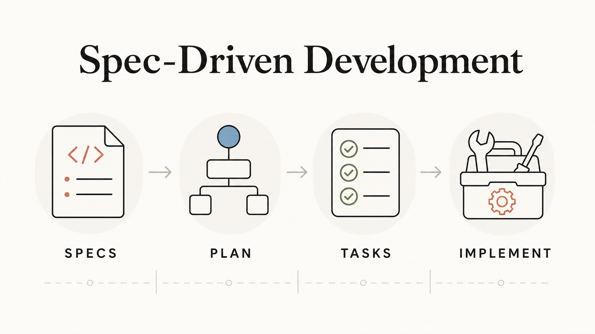
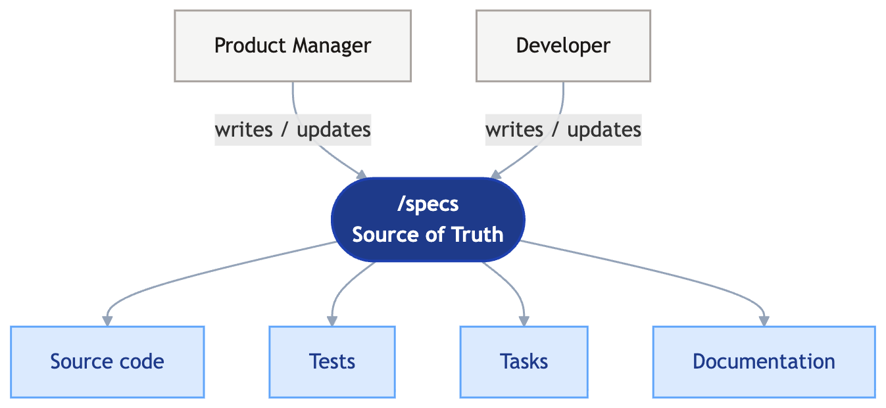
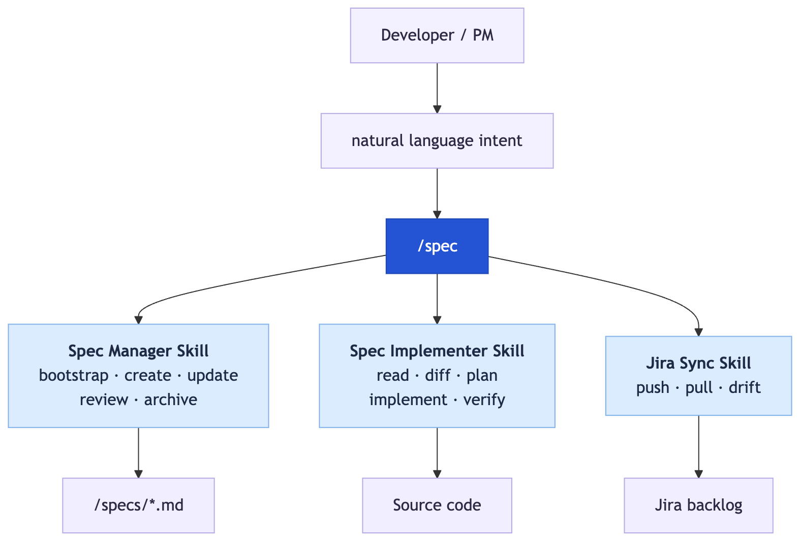

*Why centralized Markdown specs are the missing layer for AI-accelerated teams — and how to put it into practice.*



*After running Spec-Driven Development across 8 production projects at [Tecknoworks](https://tecknoworks.com), this is the guide — what works, what doesn't, and the patterns we landed on.*

## Table of contents

## Why Spec-Driven Development

Below is the case for Spec-Driven Development — what changed in software development over the past 18 months, where the cost concentrates, and why specs are the lightest fix that actually compounds.

### Coding isn't the bottleneck anymore

Software development used to have a clear bottleneck: *writing the code*. Since generative AI landed in mainstream coding workflows, that has flipped completely. With modern AI coding assistants, almost every new feature or story can be implemented in a **single, well-defined prompt** — provided you have the right requirements at hand.

The bottleneck is no longer coding. It's **understanding what to build** — and giving the LLM the right context to build it.

That bottleneck doesn't matter for prototypes — vibe-code freely, throw the prompts away, ship. But for **production software that evolves** — real users, features accumulating over months or years, multiple authors, new requirements every week — vibe-coding stops compounding. The "understanding what to build" problem eats the coding gains AI gave you. *That's* what SDD is built for. (We'll get concrete on the failure modes near the end.)

### The new bottleneck: requirements + context

Three things have to happen before AI can ship a feature:

1. The requirements have to be defined and understood.
2. The relevant context — existing patterns, related modules, prior decisions, constraints — has to be gathered.
3. All of that has to be packaged into something the LLM can actually ingest.

Today, all three are scattered. Requirements live across PMs' minds, Jira, Confluence, Notion, meeting recordings, and Teams. Context lives in senior engineers' heads, old PRs, and tribal knowledge. The result: engineers who can theoretically ship 5x faster spend most of their time on requirements archaeology and context assembly.

Onboarding suffers the same way — every new joiner re-derives what the product is *meant to do* from scattered Jira threads and senior-engineer pings.

This is where SDD compounds. A spec captures the requirements, the constraints, and the relevant context in plain Markdown — already in a format the LLM consumes natively. *Find it, structure it, package it for the LLM* collapses into *open the file*.

### The sprint has inverted

The clearest way to see the shift is to look at how a 2-week sprint used to break down vs. how it breaks down now:

| Sprint phase             | Traditional      | AI-accelerated    |
| ------------------------ | ---------------- | ----------------- |
| Coding                   | ~7 days          | ~1–2 days         |
| Requirements & PM        | ~3 days          | ~3 days           |
| **Total sprint**         | **~10 days**     | **~4–5 days**     |

Requirements work doesn't expand — it stays roughly fixed. But because AI compresses coding by 5–10x, requirements goes from being ~30% of the sprint to ~70% of it. The bottleneck doesn't disappear when you accelerate one side of the work; it just moves.

Most teams adopting AI coding stop here, with the bottleneck firmly parked in requirements. **Spec-Driven Development is what accelerates the requirements side too**, so the gains compound instead of capping out at "we code faster, but spend the rest of the sprint in meetings."

### Specs solve the alignment problems code can't

Code is a lossy projection of intent. Why a feature exists, what it's *trying* to achieve for the user, what was deliberately excluded, what constraints shaped the design — none of that lives in the code. When you ship from a prompt and throw the prompt away, you're version-controlling the output and shredding the source.

The most expensive consequence shows up in **PM-developer alignment.** Without a shared, current record of what the system is supposed to do, every conversation re-derives the same context: clarifying questions, partial answers, "didn't we agree on…" debates. The team is in a constant state of soft re-alignment, and each cycle is lossy. The spec collapses this into a single artifact: both sides look at the same document, the diff *is* the conversation, and disagreements surface immediately — when reviewing a spec change — rather than two weeks later in a PR.

A few smaller failure modes specs also clean up:

- **Stale Jira tickets.** Projects accumulate dozens of tickets over time. They conflict, go stale, and contradict each other. A developer working on a new story can unknowingly violate decisions captured in an older ticket nobody remembers. The current spec, by definition, can't go stale this way.
- **The bug-vs-feature debate.** If the system doesn't behave as the spec describes, it's a bug. If the desired behavior isn't in the spec, it's a feature request. No more arguments about what "should have been obvious."

## What a Spec Actually Is

A spec is a Markdown file that describes — in plain language — what your system is supposed to do for users. The full `/specs` folder, taken together, is a single, version-controlled, exhaustive record of product behavior. **And it's always current** — the spec describes what the system is meant to do *right now*, not what it was meant to do six months ago when some original ticket was written. That distinction matters more than it sounds, and we'll come back to it in a moment. SDD is the practice of treating that folder as the **source of truth**: code is generated from it, tests trace back to it, documentation is regenerated from it. The code becomes downstream of the spec. **The spec becomes the contract.**

That's a small but important inversion. Most teams treat code as the source of truth and docs as commentary that goes stale a week later. SDD flips the polarity.

### What derives from the spec

Once the spec is the source of truth, everything downstream regenerates from it: source code, tests, tasks, documentation. When the spec changes, the implementation changes — and so do the tests, the docs, and the work plan.



The same compression happening on the coding side now happens anywhere downstream of the spec — for tests, for tasks, for documentation. We'll come back to specific applications in [Specs Beyond Coding](#specs-beyond-coding).

### Spec vs Jira ticket vs PRD

The most common pushback when introducing SDD is *"don't user stories already do this?"* Not really. These three artifacts capture different shapes of requirement, and confusing them is the main reason teams resist SDD ("we already have Jira").

| Artifact          | Shape                                                                    | Time horizon                                                         |
| ----------------- | ------------------------------------------------------------------------ | -------------------------------------------------------------------- |
| **PRD**           | Formal deliverable defining what the product *will* be.                  | Snapshot — written once at project or initiative kickoff.            |
| **Jira ticket**   | A scoped unit of *work* the team is doing this sprint.                   | Snapshot — frozen the moment QA approves it.                         |
| **Spec**          | A living description of what the product currently *does and should do*. | Continuous — updated every time the requirement changes.             |

A Jira ticket is a snapshot. Once QA-approved, it freezes there — three months later, when a new requirement contradicts it, the ticket is part of the past, not the present. **The spec is the present.** It's continuously updated, so the diff between yesterday's spec and today's spec *is* the work being done now. That's exactly what makes specs useful for AI coding assistants: they always reflect current intent.

**Specs don't automatically replace Jira.** By default, they sit alongside it: Jira keeps doing what it's good at — sprint planning, task tracking, time logging, stakeholder reporting. Specs become the exhaustive, current record of *what the product does*. One is the changelog of work; the other is the contract for behavior.

That said, several teams we've worked with have **dropped Jira entirely** once specs became the primary alignment surface — including the PMs themselves. On one client engagement, the PM took over spec authorship directly: after every meeting, *he* updated the specs from the transcript, and we never created a Jira ticket again. Whether to keep Jira or move to a Markdown-only model comes down to organizational requirements (reporting, time tracking, audit). The trade-off is covered in [Specs and Project Management](#specs-and-project-management) below, and the specific story is in [What we've seen in practice](#what-weve-seen-in-practice).

### Specs vs technical documentation

Specs describe **what and why** — acceptance criteria, user workflows, business constraints, non-goals. They should be readable by a non-technical stakeholder.

Technical documentation describes **how** — architecture, API contracts, data models, deployment topology. That lives separately (in `docs/`, ADRs, or a wiki) and is consumed by engineers.

If your spec contains an API endpoint, a database schema, or a framework choice, it has drifted into technical territory. The *constraint vs. solution* test in [What Goes In a Spec](#what-goes-in-a-spec-and-what-doesnt) keeps this clean in practice.

## The /specs Folder Structure

The recommended approach is to place a `/specs` folder at the root of your project repository. This gives the AI coding assistant direct access and keeps specs version-controlled alongside the code. They diff. They review in PRs. They're the same artifact for humans and AI.

A typical structure:

```text
/specs
├── README.md                       # Index + coverage map
├── _template.md                    # Template for new specs
├── user-authentication.md          # Standalone spec
├── notifications.md
├── reports/                        # Group when a domain has multiple specs
│   ├── overview.md
│   ├── scheduling.md
│   └── export.md
├── payments/
│   ├── checkout-flow.md
│   └── refunds.md
└── archive/                        # Superseded specs (don't delete — archive)
    └── old-feature.md
```

A few rules of thumb:

- **One spec file per user workflow** — not per ticket, not per technical component. Organize by what users *do*.
- **Keep individual specs under ~200 lines.** If a spec grows beyond one concern, split it.
- **Each requirement lives in exactly one spec.** When two specs touch the same requirement, the spec whose domain owns the data wins. The other spec cross-references it. This is the most common spec maintenance failure mode — two teams independently writing the same requirement and updating them inconsistently over time.
- **Maintain a coverage map** in the README — a matrix of user roles against workflows, with explicit `**GAP**` rows where specs don't yet exist. This is the only way an index can tell you what's *missing*.

## What Goes In a Spec (and What Doesn't)

The single most useful test for whether something belongs in a product spec: **constraints narrow the solution space; solutions fill it.**

Product specs define constraints. Technical specs define solutions.

| Belongs in product spec (constraint)               | Belongs in technical spec / ADR (solution)              |
| -------------------------------------------------- | ------------------------------------------------------- |
| "Must integrate with BC v16 on-premises"           | "Deploy custom AL extension with PageType = API"        |
| "Human must review before posting"                 | "Use BC's Receive and Invoice action"                   |
| "Invoice PDF must be accessible during review"     | "Attach PDF via documentAttach endpoint at draft time"  |
| "System must work after migration to Cloud BC"     | "Parameterize base URL, abstract auth layer"            |

If you find yourself writing API endpoints, database schemas, framework choices, or port numbers in a product spec — stop. Those are solutions, not constraints. Move them to a technical spec or an ADR.

A minimal spec template looks like this:

```markdown
# [Feature Name]

**Status:** Draft | In Review | Approved | Superseded
**Owner:** [Name / Team]
**Last Updated:** [YYYY-MM-DD]

## Problem
A specific story showing why the status quo doesn't work. Name the user.

## Users
| User           | Role           | Context              |
| -------------- | -------------- | -------------------- |
| [Name/Persona] | [What they do] | [Relevant details]   |

## Goals
- [Outcome this feature serves]

## Non-Goals
- [Thing we are deliberately not doing — prevents scope creep]

## Acceptance Criteria
- **AC-1:** [Concrete, testable, plain-language behavior]
- **AC-2:** ...

## Constraints
| Constraint | Source | Impact |

## Risks & Open Questions
- [ ] [Decision still to be resolved]
```

Two sections do most of the heavy lifting and most teams skip them: **Problem** and **Users**. They force you to name the person affected and describe their pain *before* jumping into requirements. Without them, specs drift toward technical wish-lists with no human in them. **Non-Goals** are equally important — they prevent scope creep by making exclusions *explicit* rather than implied.

Each acceptance criterion gets a stable ID (`AC-1`, `AC-2`, …) so you can reference it from commits, Jira tickets, and tests. When a criterion is deprecated, strikethrough it rather than deleting it: `~~**AC-3:** ...~~ [DEPRECATED: reason]`. History has value.

## What Makes a Good Spec

A few rules of thumb that hold up across every project we've used SDD on. Don't over-think this — the goal is *good enough to align on*, not perfect.

- **No duplicate requirements.** Each requirement should live in exactly one spec. We use **MECE** as the breakdown principle when splitting specs across files — *mutually exclusive* (no two specs cover the same requirement) and *collectively exhaustive* (every user-facing behavior lives somewhere). When two specs touch the same requirement, the one whose domain owns the data wins; the other cross-references it.
- **Plain language, testable.** Each acceptance criterion should be specific enough for a QA to write a test from it, written without implementation jargon. Vague ACs ("should work well", "perform reliably") are dead weight.
- **No implementation details.** If the spec mentions an API endpoint, database schema, or framework choice, it has drifted into technical territory — move those to a TDD or ADR.
- **Open Questions are a feature, not a flaw.** A spec with no open questions almost always hasn't been stress-tested by reality. Surface what you don't know.

A spec that's 70% right and updated weekly beats a 95%-right spec that goes stale in two months. Iterate.

## The Day-to-Day Workflow

Once specs exist, the workflow collapses to one rule:

> **Always update the spec before writing code.**

When new requirements arrive — from a client, a PM, an internal discussion — the spec gets updated *first*. Only after the spec reflects the new reality do you proceed to implementation.

In practice, the loop looks like this:

```text
Requirements arrive   →   Update the spec   →   PM reviews     →   Implement with AI
(any format)              (Markdown PR)         the diff           from the updated spec
```

Four steps:

1. **Requirements arrive** in whatever channel is natural — Teams call, Jira ticket, email, transcript, Slack thread. The format doesn't matter.
2. **Developer (or PM) updates the spec.** AI helps here — feed it the raw input and ask it to *"update `/specs/feature-x.md` based on these new requirements."* The AI structures it into the template format.
3. **PM reviews the spec change.** Either as a PR diff (if the PM is Git-comfortable) or a rendered Markdown preview. The diff *is* the contract.
4. **Developer implements with AI**, pointing the assistant at the updated spec and the git diff:

```text
The spec at /specs/reporting.md has been updated with new requirements.
Review the recent changes (check git diff on the spec file), read the
full spec for context, then create a plan and implement the new requirements.
Follow existing patterns in the codebase.
```

That's it. With modern models (late 2025 onwards), this works for most use cases we've seen in practice. The AI reads the spec, runs `git diff` to see what changed, explores the codebase, plans the implementation, and executes.

The spec diff is the implementation brief.

## Specs and Project Management

The most common question I get: *"Does this replace Jira?"*

Answer: it depends on your team. Two valid models, pick the one that fits.

| Factor                   | Specs + Jira                                          | Specs + `/tasks` folder                            |
| ------------------------ | ----------------------------------------------------- | -------------------------------------------------- |
| **Best when**            | Org needs Jira for reporting, time tracking, or compliance | Small-to-medium team optimizing for speed     |
| **Requirements**         | `/specs` (source of truth)                            | `/specs` (source of truth)                         |
| **Task tracking**        | Jira epics / stories                                  | `/tasks` folder of Markdown files                  |
| **Time logging**         | Jira time tracking                                    | External tool or not tracked                       |
| **Audit trail**          | Jira history + Git history                            | Git history + PR reviews                           |
| **Cross-team dashboards** | Jira filters and reports                             | `git log` + repo navigation                        |

Most of our enterprise projects run **Specs + Jira**. Each tool does what it's best at — specs are the exhaustive requirements record; Jira is the task tracker and sprint planning surface. The `/spec` orchestrator covered in the next chapter includes a Jira sync skill that pushes spec acceptance criteria into Jira as epics and stories, so the two stay in lockstep.

For smaller teams that want to drop Jira entirely, the alternative is to apply the same SDD pattern to tasks themselves — a `/tasks` folder of Markdown files, version-controlled alongside `/specs`. That's covered further down in [Specs Beyond Coding](#specs-beyond-coding).

## Putting It Into Practice With Claude Skills

Honestly, the SDD process is simple enough that you don't need any tooling beyond a `/specs` folder, the template, and the rule *"always update the spec before writing code."* If you're a small team or a solo developer, plain Claude Code (or Cursor, or Copilot) is enough — point it at the folder and ship. No orchestrator required. A single lightweight Claude skill that knows the conventions is the most you'd need.

We've built more than that because we needed **consistency across teams**. Tecknoworks runs SDD on **over 15 development teams** now, and standardizing how specs get bootstrapped, updated, implemented, and synced across every project required shared infrastructure. We built it with a small set of Claude skills wired together behind a single command: **`/spec`**.

If you're a smaller team or working on a single project, the rest of this section is mostly informational — feel free to skim. If you're trying to run SDD across multiple squads consistently, this is the model we landed on.

You don't memorize subcommands or flags. You type `/spec`, optionally describe what you want in plain language, and the orchestrator figures out the right action from the project state and your intent.

For example:

- `/spec` — inspects the project (does `/specs/` exist? are there uncommitted spec changes? any stale drafts?) and suggests the most useful next step.
- `/spec bootstrap from this design doc` — creates `/specs/` from an existing source.
- `/spec implement` — detects the changed spec via `git diff`, plans, and codes the change.
- `/spec sync to Jira` — pushes spec acceptance criteria as epics and stories.

That's the surface area. There's no framework to learn — the AI handles routing, the human stays in natural language. Underneath, three specialist skills do the actual work.



The skills themselves are proprietary to Tecknoworks, so I can't share the full implementations. But the overview below covers the shape of the system — what each specialist skill does, and the rules that make it work in practice.

### 1. The Spec Manager — Bootstrap, Create, Update, Review, Archive

This skill handles the entire authoring side of the lifecycle. The most interesting mode is **bootstrap from a technical document**, which is also the place where AI most commonly fails — it tends to reproduce technical details as product requirements verbatim, producing specs that read like repackaged TDDs.

The skill explicitly counters this with an *abstract-up* step. For each technical statement in the source, it asks: *"What is the user trying to accomplish?"* — and writes that instead.

| Technical source says                          | Product spec says                                                                              |
| ---------------------------------------------- | ---------------------------------------------------------------------------------------------- |
| `POST /api/v1.0/purchaseInvoices`              | "When an invoice is received, the system captures the vendor, amount, and line items"          |
| "Use OCR to extract header fields"             | "The system automatically reads invoice header information"                                    |
| "Deploy BC API facade on port 7048"            | Constraint: "Must integrate with BC v16 on-premises"                                           |

The technical details aren't lost — they get routed to a separate TDD generator skill so they live in `docs/` or an ADR, not in the product spec.

The skill also enforces a **three-question test** for whether something even qualifies as a product spec domain:

1. Does a specific user interact with this? *(If no → technical spec)*
2. Can you describe it without specifying protocols or implementation? *(If no → technical spec)*
3. Would a non-technical stakeholder need to validate this? *(If no → technical spec)*

`bc-api-facade` is a technical component (no user interacts with it) — it goes in `docs/`. `invoice-review-queue` is a user workflow (Shauna reviews invoices there) — it gets a product spec.

### 2. The Spec Implementer — Daily Developer Loop

The whole loop is dead simple from a developer's perspective:

1. New requirements arrive (transcript, email, ticket — any format).
2. You update the spec.
3. You tell Claude to implement.

That's it. Under the hood the skill reads the full spec, runs `git diff` to see what changed, plans, codes, and verifies each acceptance criterion against the result — but as a developer, you only ever interact with steps 1–3. If something can't be implemented exactly as the spec describes, the skill flags it back to the PM rather than guessing. Spec drift dies here.

### 3. The Jira Sync — Bidirectional Bridge

This is the optional skill that keeps specs and Jira honest if your org uses both. Three modes:

- **Specs → Jira** — push spec acceptance criteria as Jira stories, grouped under one epic per spec file.
- **Jira → Specs** — bootstrap specs from an existing Jira backlog (useful when adopting SDD on a long-running project).
- **Drift Check** — compare both sides and report the gap.

The mapping is straightforward:

```text
/specs/workflow-name.md     →  Jira Epic: "[Workflow Name]"
  Acceptance Criterion #1   →    Story: "[Criterion text]"
  Acceptance Criterion #2   →    Story: "[Criterion text]"
  Open Question #1          →    Story (flagged/blocked)
```

The drift check is the part that earns its keep over time. It produces a report like this:

```markdown
## Drift Report — 2026-05-09

### Spec criteria without Jira tickets
| Spec          | AC-ID | Criterion                          | Action            |
| ------------- | ----- | ---------------------------------- | ----------------- |
| reporting.md  | AC-14 | CSV export for large datasets      | Create Jira story |
| reporting.md  | AC-15 | Export audit logging               | Create Jira story |

### Jira tickets without spec criteria
| Ticket   | Summary                | Status     | Action                                    |
| -------- | ---------------------- | ---------- | ----------------------------------------- |
| RPT-150  | Add PDF watermark      | To Do      | Add to specs/reporting.md or remove       |
| AUTH-110 | SSO timeout config     | In Progress| Add to specs/authentication.md            |

### Possible text mismatches
| Spec     | AC-ID | Jira     | Difference                                                   |
| -------- | ----- | -------- | ------------------------------------------------------------ |
| auth.md  | AC-3  | AUTH-103 | Spec says "30-min timeout", Jira says "15-min timeout"       |
```

A few sync rules that prevent the most common failure modes:

- **Never create duplicate stories.** Check by label `spec:{filename}` + `{ac-id}` before creating.
- **Never overwrite Jira metadata.** Assignee, sprint, status, story points are sacred — sync only adds, never silently mutates.
- **Never auto-update story text.** If a criterion changed, flag it for human review rather than silently rewriting the Jira story.

## Specs Beyond Coding

The compression that AI brought to coding doesn't stop at code. Anything downstream of the spec — tests, tasks, documentation — can be regenerated and kept current the same way. Once the spec is the source of truth, everything that traces back to it benefits from the same shift: humans write the spec, AI handles the mechanical translation into the downstream artifact.

Two applications I've seen pay off the most in practice are QA test case generation and task management.

### QA test case generation

One of the most underrated payoffs of treating the spec as the source of truth is **QA test case generation.**

Traditionally, manual QA teams spend days writing test cases — reading user stories, mapping acceptance criteria, drafting Given/When/Then scenarios, and copy-pasting them into Azure DevOps or TestRail one field at a time. With specs, that work collapses. Acceptance criteria are already structured in the spec; Claude reads them and generates the test cases in seconds — including edge cases QAs might have missed.

The QA team's job shifts from *authoring* tests to *validating, expanding, and running* them. That's the work that actually requires human judgment — the part that benefits from a domain expert's eye. The mechanical translation of "AC-12: CSV export available for all report types" into a Given/When/Then scenario in TestRail — the part QAs lose entire days to — disappears.

If the test cases are themselves committed alongside the spec (or generated on demand from spec diffs), the testing artifact stays in lockstep with the requirements. The classic "manual test cases drifted from the actual product behavior" failure mode goes away.

### Task management with a /tasks folder

The same pattern that works for specs works for tasks. Most teams I've seen adopt SDD eventually drop manual Jira ticket creation and manage tasks the same way: a `/tasks` folder of Markdown files, version-controlled alongside `/specs` and the code.

The structure mirrors the spec folder — one task file per feature or domain area, with each file listing the work derived from the corresponding spec. When a spec gets a new acceptance criterion, the matching task file gets a new entry. Tasks track status (Not Started / In Progress / Done), reference specific AC IDs, and capture blockers or open questions inline. Claude generates the task entries directly from spec diffs, so the manual translation step ("now go create the Jira ticket") disappears.

Why teams move to this:

- **One mental model.** Specs are Markdown. Tasks are Markdown. Everything is in the repo, diffable in PRs, attributable in git.
- **No drift.** Tasks reference spec ACs by ID. If an AC moves or gets deprecated, the link is right there in the file.
- **Frictionless review.** A PR shipping a feature contains the spec change, the task entries, and the implementation — all in one diff.

For organizations that need Jira for reporting, time tracking, or compliance, this won't replace it — see [Specs and Project Management](#specs-and-project-management) above. But for teams whose primary goal is *move fast and ship*, the `/tasks` folder pattern eliminates an entire layer of tooling friction — the same way `/specs` did for requirements.

## What we've seen in practice

We've now deployed SDD across **eight real client projects**, including an engagement with a top-three global management consultancy. The most surprising pattern: **PMs themselves take over the spec-writing**, not just developers.

On that consultancy project, the lead stakeholder installed Claude Code himself in week two. From that point on, after every meeting, *he* updated the specs from the transcript — no developer translation step, no Jira tickets, no requirements-clarification meetings. We dropped Jira entirely. The spec was the contract; the diff was the conversation.

His words: *"It feels like a revolution in product management and software development."*

His estimate: **roughly 3x faster delivery** — driven by collapsing the full requirements loop. What used to be daily clarification meetings, Jira tickets, developer translation, and back-and-forth review became a single spec edit feeding the AI directly into a PR.

Across the eight projects, the consistent pattern is **around 50% efficiency gains on requirements-to-merged-PR cycles** vs. the same teams' pre-SDD baseline — biggest wins on long-lived, evolving production software.

One anecdote that crystallized the case for me: on a separate long-running platform, a single permissioning change once generated *three days* of back-and-forth — contradictory expectations spread across older tickets, no authoritative source for current behavior. The fix was a spec: capture the rules, surface the contradictions, get sign-off, delegate implementation. The same kind of change, today, takes hours.

## Why vibe-coding breaks at production scale

Earlier I drew a line between vibe-coded prototypes — where SDD is overhead — and production software, where it's a force multiplier. Three failure modes hit at production scale that prototypes never see:

- **Regression risk compounds.** Without a single, current, exhaustive record of expected behavior, every change is a gamble — and "we'll catch it in QA" quietly becomes the only acceptance criterion still holding.
- **Communication friction explodes.** What's new vs. what already exists vs. what was deprecated becomes a daily debate. Half the sprint is gone before anyone writes code.
- **Onboarding becomes archaeology.** New joiners piece together what the system does today from Jira, tribal knowledge, old PRs, and reading code — slowly, and incompletely. The senior engineer becomes a permanent dependency.

For greenfield, none of this matters. For evolving production code, it's the daily reality — and it's where AI-accelerated coding *stops compounding* unless you fix the requirements layer too.

## Where to Go From Here

If you take one thing away from this guide: **stop throwing away your prompts.** The prompt is your spec. Capture it once, version-control it, and let the AI regenerate the code from it as the spec evolves.

Concretely, here's what I'd do this week:

1. **Pick one feature** in your codebase — preferably one that's actively changing.
2. **Bootstrap a single spec file** for it, using the template above. Use AI to do the heavy lifting; review for abstraction-level mistakes (no API endpoints, no schemas, no framework names).
3. **Get PM sign-off** on that one spec. The diff *is* the contract.
4. **Implement the next change to that feature spec-first** — update the spec, then point the AI at the diff. Compare the experience to your old workflow.
5. If it clicks, expand to a second spec. If not, you've spent an afternoon learning where it doesn't fit your team.

The full guide — including the Claude skill orchestrator, the spec manager, the implementer, and the Jira sync — runs across every AI engagement we've shipped in the last year. Specs aren't extra work. They're the work you were already doing, captured once instead of repeatedly reinvented.

The bottleneck isn't the code anymore. Let's stop pretending it is.

---

If you build your own version, I'd love to hear how it goes — find me on [LinkedIn](https://www.linkedin.com/in/evgeni-rusev-24636017b/).
