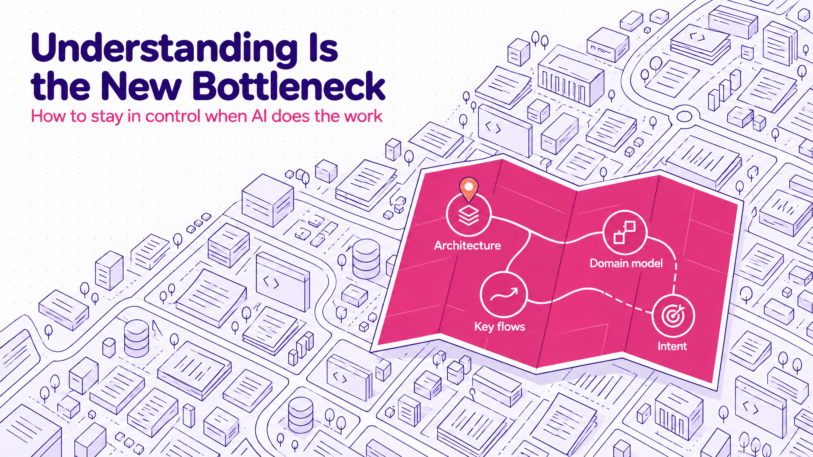
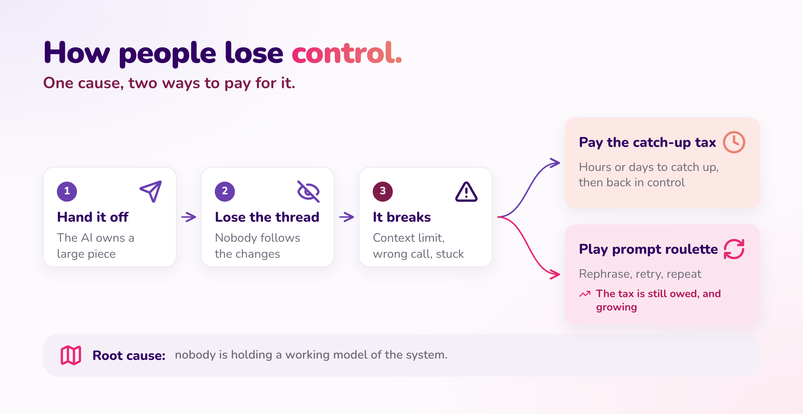
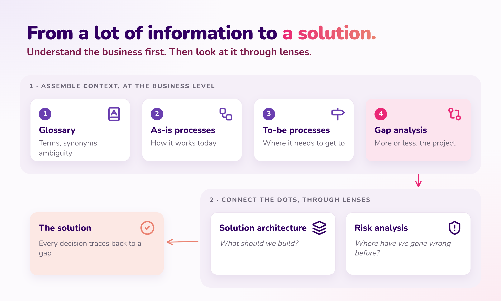
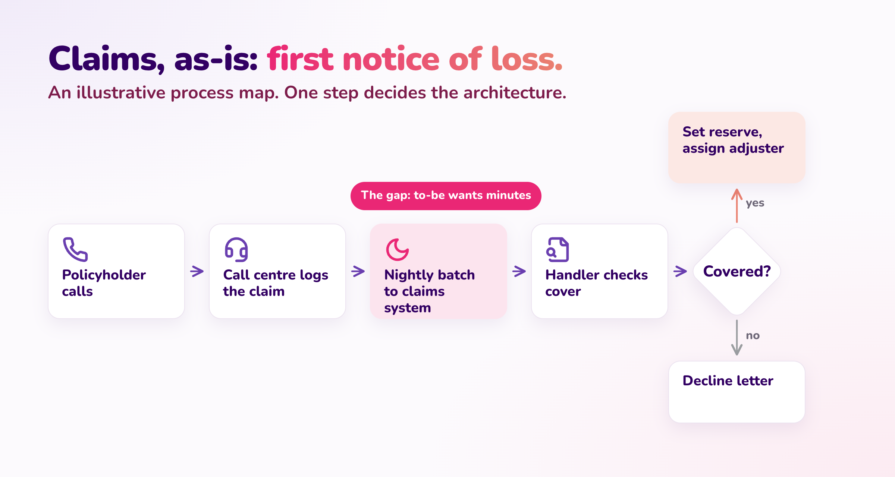

I read [a post from Andrej Karpathy](https://x.com/karpathy/status/2105819303471976479) recently, and it helped me name something I've been struggling with for the past couple of months: **understanding is the new bottleneck to high-performance work.**

His point is that as AI does more of the hands-on work on its own, more of our work moves up into oversight and understanding.

I'd take it one step further: **the biggest lever we can pull to unlock further AI acceleration is how we process AI-generated information**: being far more deliberate about what we choose to understand, what to discard, and what "enough" understanding means. The new high performers maximise the AI's autonomy while completing a good-enough review as quickly and effectively as possible.

Understanding isn't just a matter of effort or talent, though. It's something you can engineer: by managing what context you take in and in what form, and by putting structures in place that make a system easy to understand.

This post is about what that looks like in practice: how people lose control, the skills that replace raw coding speed, how I apply them, and what it means for how teams are set up.

## Table of contents

## What Changed

For most of my career, the high performer on an engineering team was, more or less, the fastest coder. The person who could take a vague ticket and turn it into working code before anyone else had finished reading it.

It's one of the reasons a strong competitive-programming background was almost always a good signal for a high performer. It correlates with turning a problem into a lot of correct code, quickly.

That person still matters, but the speed of writing code is no longer what separates people. When an agent can produce a feature in minutes, the slow part moves somewhere else: knowing what to ask for, knowing whether what came back is right, and knowing how it fits with everything else.

When people don't adjust to that, I keep seeing the same pattern play out.

## How People Lose Control



### Losing the thread

It starts with someone handing the AI a large piece of the codebase to own, letting it run, and no longer following what it's doing. For a while it looks like great progress.

The problem is that AI judgement gets worse as the system gets more complex. On a small, well-bounded task, it's excellent. On a large system with many moving parts, it starts making locally reasonable decisions that don't add up globally. If nobody holds the global picture, nobody notices until it hurts.

### Then: pay the catch-up tax, or play prompt roulette

Then the AI hits the limit of its context window, or makes a decision that doesn't fit, or just gets stuck. At that point there are two options.

The first is to pay **the catch-up tax**: spend a few hours, sometimes a few days, catching up on what was built before you can do anything useful. The time you "saved" comes back with interest.

The second is to avoid paying it, and that's where **prompt roulette** comes in. Instead of stopping to understand, the person asks the AI to fix it, doesn't get quite what they wanted, rephrases, tries again, adds a few words, tries again. An hour later they're still spinning.

Prompt roulette feels cheaper than catching up, but it isn't. Without understanding the structures the change has to fit into, you can't tell the AI *why* its answer is wrong, so all you can do is ask again and hope. The tax is still owed; it just keeps growing while you spin. Once you understand the structure, the right prompt is usually obvious, and often it's a single one.

Roulette doesn't only follow a lost thread, either. It's also what happens when someone never built the understanding in the first place.

### The same pattern at scale: software factories

You can see the same pattern at a much larger scale in "software factories". Over the past year, many companies have built some form of software factory as a layer on top of Claude Code: agents handing work to other agents, requirements in, code out. They can get you further than Claude Code on its own. But eventually the same thing happens: nobody knows what's going on in the codebase anymore, the AI starts making bad architecture decisions, and the team has to spend weeks working out what's actually in place. It's the catch-up tax, paid in weeks instead of hours.

Dex Horthy tells a good version of this story in his talk [Why Software Factories Fail](https://www.youtube.com/watch?v=Ib5GBkD555M). In July 2025 he ran a "lights-off" software factory where nobody read the code. It worked until an issue appeared that no amount of prompting could fix (prompt roulette again), the site went down, and he was digging through a codebase he'd stopped reading three months earlier. His explanation is worth the watch: coding models are trained to pass tests, and nothing in that training penalises bad architecture, whose cost only shows up months later. His fix is to turn the lights back on and plan up front.

The "software factory" framing is compelling, which is why it's so common. But it can be misleading, because it implies an automated factory that takes in requirements and produces what you need. AI software factories fail when no one meaningfully reviews what they produce.

That's why I prefer the framing "AI-First SDLC". It sets more realistic expectations, and it's the right mental model for what's actually happening on the ground. You can call it a software factory if you like; the name matters less than the operating model underneath:

<p class="callout">Human intent and design → AI-accelerated implementation → human verification and ownership.</p>

The humans never leave the loop. They own the intent at the start and the verification at the end, and the AI accelerates everything in between. More on how that works in practice [below](#an-example-specs-in-the-ai-first-sdlc).

### One cause

Whether it's one person or a whole factory, the cause is the same: **nobody is holding a working model of the system.** Either it was handed to the AI, or it was never built. Neither is fixed by better prompts or a bigger context window.

## The New High Performers

<p class="callout">The new high performers are the people who reach a working understanding of the system fastest, and stay in control of it while the AI accelerates everything else.</p>

In practice that breaks down into three skills, and the rest of this post takes them one at a time:

| Skill | What it means |
|---|---|
| **Assembling context** | Finding the information that matters (the business process, the constraints, the decisions already made) and giving it to the AI in a shape it can use. |
| **Connecting the dots** | Seeing how a change in one place affects another. Holding the overall structure in your head, not every line. |
| **Verifying efficiently** | AI output is often large. The skill is reaching confidence that it's right with the least time spent, not reading every line. |

None of the three runs on effort alone. Assembling context is context management: deciding what goes in, and in what form. Connecting the dots and verifying both depend on structure: a small set of things that describe the system, written down where you and the AI can both check against them. The rest of this post covers both.

This needs a change in how we measure ourselves, and it's the hardest part. Most engineers, me included, have spent years feeling productive in proportion to the code we produced. That instinct now works against us: it pushes people to keep the AI generating, because generating feels like progress.

The better measure is: **how quickly did I get to the core understanding that keeps me in control?** Once you have it, acceleration on everything else is safe. Without it, every bit of acceleration adds to a debt you'll pay later, usually as a catch-up tax.

## What to Hold in Your Head: The Four Levers

Before the three skills, one question: understanding *what*, exactly? Not everything. That's the point.

I've often noticed that smart people can ramp up on almost any new domain remarkably quickly. Why? It comes down to the same pattern: they know which information to focus on and which to discard, and they're clear about what they know and what they don't.

It reminds me of a line from *The Great Mental Models* by Shane Parrish: "A mental model is a compression of how something works." Like a map, a good mental model keeps the key information and leaves out the rest. You probably have a useful idea of how inertia works without knowing all the technical details.

That's what you need of the system the AI is building with you: a compressed model of how it works, not a copy of it. You don't need to understand every line the AI writes. You do need to understand the few structures that tell you where the main levers are. Call them **the four levers**:

1. **Architecture decisions:** how the system is split, where the boundaries are, what talks to what.
2. **The domain model:** the main entities, the rules between them, the words the business uses for them.
3. **The key flows:** how a request, an order, a document moves through the system end to end.
4. **The intent:** what each feature is supposed to do and why, written down somewhere outside the code.

Hold those four, and you can let the AI move fast on everything underneath them.

## Assembling Context: How I Get Up to Speed on a Lot of Information Fast

More and more of the work is taking in a large amount of information quickly: a new codebase, a stack of requirements documents and meeting transcripts, a big AI-generated change, a new business. The temptation is to read it all, or to skip it and jump straight into the code or the backlog. I try hard to do neither.

Instead, I use a few Claude skills I've built that distil information into its fundamental patterns: what the key concepts are, how things flow, and what matters most.



The clearest example is a new business domain. A lot of my work is consulting, so I'm often dropped into a business I don't know yet: legal, mining, insurance, manufacturing. There, I ask for four things, in this order:

1. **A glossary of the terminology.** Every term the business uses, what it means, and which terms mean almost the same thing. Half the confusion in a new domain is vocabulary.
2. **As-is process maps.** How the business operates today, end to end, as a set of holistic processes: who does what, with which inputs, producing which outputs.
3. **To-be process maps.** Where the business wants to get to.
4. **A gap analysis.** What has to change to get from as-is to to-be: for each gap, what it is, who it affects, and how big it is. This is, more or less, the project.

The prompt is roughly:

```text
From the documents and transcripts in this folder:
1. Build a glossary of the business terms. Flag synonyms and ambiguous terms.
2. Map the current (as-is) processes end to end as Mermaid flowcharts.
   One diagram per process. Actors, inputs, outputs, decision points.
3. Map the target (to-be) processes the same way.
4. Write a gap analysis: for each gap between as-is and to-be,
   what changes, who it affects, and how big it is.
Stay at the business level. No technology, no solutions yet.
```

### What it looks like: an example

To make it concrete, here's an illustrative example, a generic insurance claims process rather than a real engagement.

The **glossary** usually pays for itself in the first ten minutes. Three rows from one like it:

| Term | Meaning | Flag |
|---|---|---|
| **Claim** | A policyholder's request for payment after a loss. | Also called "case" by the claims team and "file" in the legacy system. Same thing, three names. |
| **FNOL** | First notice of loss: the moment the insurer first hears about the loss. | The clock for service-level targets starts here. |
| **Reserve** | The amount set aside for what the claim is expected to cost. | Not the same as the payout. Finance and claims use it differently. |

The **as-is map** for first notice of loss might look like this:



The to-be map says the business wants claims triaged within minutes of the call. The **gap analysis** then surfaces the one gap that matters most: policy data only reaches the claims system in a nightly batch. That single line changes the architecture. Triage-in-minutes needs a live policy lookup, not a smarter triage model sitting on day-old data. Finding that in a process map on day two is much cheaper than finding it in a sprint review in month two.

### The interactive walkthrough

For anything I need to really understand, I go one step further. I ask the AI to turn everything above into a small interactive web app that walks me through it in sequence: the vocabulary first, then one process at a time, then the gaps, each step building on the last.

```text
Turn the glossary, process maps and gap analysis into a single-page
interactive walkthrough. Step 1: the 10 terms that matter most.
Then one process per step, as-is and to-be side by side, with the
glossary terms highlighted. Last step: the gaps, biggest first.
Keep it to one HTML file I can open locally.
```

It builds up the holistic intuition in order, instead of dropping a folder of documents on me at once. It takes minutes to generate, and I throw it away once I've got what I need. A couple of years ago, nobody would have built a custom app just to understand something. Now it's cheaper than a meeting.

### Pick the format on purpose

That's the broader point: paragraphs of prose are often the slowest way to take something in. I ask for diagrams for flows, tables for anything I need to scan, and the walkthrough for anything I need to really learn.

And I see Karpathy does the same. [His post](https://x.com/karpathy/status/2105819303471976479) is exactly about this, with diagrams and web pages on his list too, plus two I hadn't tried: explanations in ASD-STE100, the controlled English used in aerospace maintenance manuals, and custom explainer videos.

## Connecting the Dots: Looking Through Different Lenses

Once I understand the processes and the gaps, I connect the dots by looking at the same information through different lenses. Each lens asks one specific question of it, and each one surfaces things the others miss.

Two examples:

- **Solution architecture** asks *what should we build?* It turns the process maps and the gap analysis into a practical architecture: which components, which boundaries, what integrates with what. In the claims example, the live policy lookup isn't an architect's preference. It traces straight back to a gap in a process map.
- **Risk analysis** asks *where have we gone wrong before?* At Tecknoworks we keep a record of lessons from past projects, including the ones that went wrong. This lens checks the new solution against that record: is there anything here where we might make the same mistake again? In the claims example, if past projects underestimated an integration with a legacy system, the live policy lookup gets flagged and tested early, not discovered late.

The order matters. The understanding comes first and the lenses second, so every decision a lens produces has something concrete to be checked against, instead of being taken on trust.

### Lenses as skills that compound

Each of these lenses is a Claude skill I've written: a reusable set of instructions for how to look at the information and what to produce. That's what makes them worth building.

The first version of a skill is usually mediocre. But every time I use one, I see where it helped and where it missed something, and I refine it. A question it should have asked, a format that was hard to read, a mistake it kept making. Over months, the skills get noticeably better, and they compound: each engagement makes the next one faster, because the lessons from the last one are now built into the skill rather than living only in my head.

## Verifying Efficiently: Reviewing to "Good Enough"

The last skill is where the four levers pay off. They're where your human review belongs.

Not "let the AI do its thing and skim the diff", but "check every change against the few structures that matter, and let tests and scenarios cover the rest". When the AI proposes something that crosses a boundary or changes a core rule, you notice immediately, because that's exactly what you're watching. The goal isn't to review everything. It's **reaching verifiability in the least amount of time**: knowing which parts you must check yourself, which parts tests can check for you, and when "good enough" really is good enough.

It also takes the sting out of the catch-up tax. If you hold the levers, a fresh session after the AI runs out of context is a few minutes of re-orientation, not a few days of archaeology.

### An example: specs in the AI-First SDLC

Where exactly that review happens depends on the project and the team. Architecture decision records, a well-kept domain model or a set of process maps can all play the role. Here's one example that works well for us.

The [AI-First SDLC](/posts/ai-first-sdlc/) supports this way of working by design. It creates a shared information structure, and a process around it, that make review and alignment fast. In that setup, the [Living Specs](/posts/ai-first-sdlc/#the-specs-in-four-formats) hold the intent, the domain rules, the scenarios and the decisions, at a level of detail a human can actually keep in their head. The code underneath is detail you can afford not to read line by line, because the scenarios check it against the spec.

So the review moves up a level. Instead of reading a 2,000-line diff, you check whether the spec still says what the business means, and whether the scenarios that prove it pass. That's the difference from a lights-off factory: the AI still does the implementation, but you stay in control through the specs.

### Signs you've lost the plot

And a quick self-check for when you've dropped below "good enough". If any of these are true, stop generating and go back to understanding:

- You've rephrased the same request three or more times.
- You can't explain the AI's last change in two sentences.
- You couldn't sketch the flow it just touched on a whiteboard.
- Starting a fresh session would take you more than an hour to get back to where you are.
- You're approving diffs because the tests pass, not because you know what changed.

## What This Means for Teams and Companies

Every company now has access to the same models and the same tools, so buying licences doesn't create an advantage on its own. The companies that will pull ahead are the ones that **reconfigure how their teams work so these three skills become easy to practise**:

| What to reconfigure | What it looks like |
|---|---|
| **Skillset** | Hiring, training and promoting for assembling context, connecting the dots and verifying, not for raw output. |
| **Process** | Capturing intent once and reviewing at the level of the four levers, not line by line in the diff. Measuring time to understanding, not lines of code or tickets closed. |
| **Structures** | Shared information structures (such as a Project Brain or Living Specs) that everyone and every agent works from, and team shapes built around them. |

None of the three works alone. A team of strong engineers with no shared structure still loses days to re-explaining. A good spec process with people who don't read the specs becomes paperwork.

What that looks like in practice, I don't fully know yet. On one project we've just started running fully on the AI-First SDLC, the biggest bottleneck so far has been managing the specs and getting people aligned; once that's done, implementation moves much faster than we're used to. That points me towards a hypothesis: on more complex projects, every team might need one person whose main job is consulting, spec management and alignment, with one owner per domain (a colleague suggests two for complex systems: a subject-matter expert and a strong agentic engineer). But we're two weeks in. I'll know much more in a few months, and my view might change.

The risk I worry about most was raised by another colleague. Documentation is the thing most developers have always hated doing, and now the shared project knowledge is the most important artefact on the project. If people treat it as something the AI fills in and nobody reads, they go shallow exactly where depth matters most. That's a skillset problem, not a tooling one, and we need to train for it deliberately rather than assume it.

## To Close

The tools made producing work cheap. What's scarce now is understanding: knowing what was built, why, and whether it's right.

The people who will do best aren't the ones who generate the most. They're the ones who get to the core understanding fastest, keep it current, and let the AI accelerate everything around it.

I'm curious: what's the longest catch-up tax you've paid on something an AI built?
