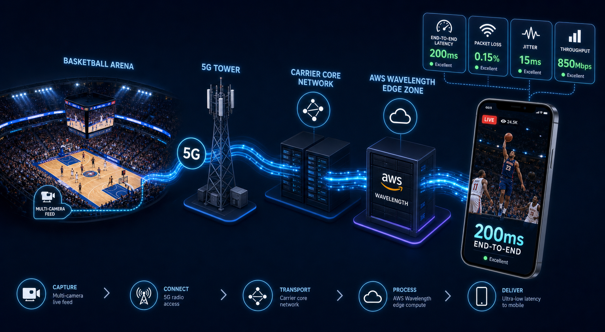

  

    
4× lower

    
Latency vs traditional internet streaming

  

  

    
200ms

    
End-to-end on 5G edge (down from 800ms)

  

  

    
1,000+

    
Concurrent live viewers per stream

  

  

    
NBA · NFL · NHL

    
Live sports broadcasts via T-Mobile, Verizon, Comcast

  

**Client:** A US-based 5G acceleration tech startup.

**Industry:** 5G, live video, edge computing.

**My Role:** Technical Lead at Tecknoworks, 2020–2021.

---

Live sports has a lag problem. Traditional cloud streaming over public internet runs ~800ms end-to-end for HD live video. By the time the dunk lands on the viewer's screen, the play is nearly a second behind reality. For hockey — where the puck crosses the rink in seconds — that's the difference between *"live"* as a marketing word and live as the actual experience.

In 2020, two technologies converged that made something different possible. **5G** was rolling out across US carriers — T-Mobile, Verizon, Comcast — with a radio interface that cut wireless latency from LTE's 30–50ms down to ~10ms. And **AWS Wavelength**, released late 2019, made it possible to deploy compute *inside* those carrier networks, eliminating the public-internet hops that had been the dominant source of streaming latency.

## Why edge compute changes the math

Traditional cloud streaming sends traffic across the public internet — ISP, transit providers, peering exchanges, datacenter — and each hop adds latency you don't control. On a good day that's 200–400ms one-way, plus encoding and buffering, putting end-to-end at 800ms+.

AWS Wavelength rewrites the path. Compute runs *inside* the telecom carrier's 5G network:

**Device** → 5G radio → carrier core → **Wavelength edge zone** → application server

No public internet. No transit ISPs. No peering points. Only carrier-internal hops — plus 5G's New Radio adding ~10ms vs LTE's 30–50ms. It's not "a better CDN" — in a CDN the edge caches stale content; in a Wavelength zone the edge is where the application runs.

In 2020, this was bleeding-edge. Wavelength had been public less than a year, with a handful of zones live in specific metros.

## The challenge

Build a real-time livestream pipeline that:

- Cuts end-to-end latency by 4× vs the standard cloud path
- Scales to 1,000+ concurrent viewers per stream
- Deploys across three US telecoms — T-Mobile, Verizon, Comcast — each with different Wavelength footprints
- Handles live sports broadcasts (NBA, NFL, NHL) where every millisecond is visible
- Falls back gracefully when 5G isn't available

Every hop was on the latency budget. Sub-200ms ruled out chunked HLS/DASH (6–30s of latency by design) — this was WebRTC-class territory.

## Impact

For viewers on partner-carrier 5G, end-to-end latency dropped from ~800ms to ~200ms — 4× lower. The platform supported up to 1,000 concurrent viewers per stream and powered live sports broadcasts across NBA, NFL, and NHL games for T-Mobile, Verizon, and Comcast.

Sub-200ms over a cellular network felt qualitatively different from any other streaming experience at the time. The lag was small enough that the broadcast felt genuinely synchronized with live action.

## What I learned

- **5G + edge compute changes the math for latency-sensitive apps.** Carrier-internal routing eliminates hops you didn't even know you had. For live video, gaming, AR/VR, real-time ML inference — the edge-vs-cloud distinction is real.
- **Pioneer-stage AWS services have their own friction.** Wavelength was less than a year old. We were figuring out best practices alongside AWS, not following a cookbook.
- **Sub-second video is an architecture problem, not a feature.** Every hop costs time. The Wavelength edge gave us the carrier-internal hop; the rest of the pipeline had to match that bar.
- **Multi-carrier deployment is its own discipline.** Three telecoms = three Wavelength footprints. CloudFormation made each carrier a parameter change, not a custom build.
- **The wow moment** — sub-200ms live hockey on a phone over 5G — foreshadowed the edge-compute shift now accelerating across gaming, AR/VR, and real-time AI inference.

## How

**Architecture:** Cameras streamed to an ingest server on AWS EC2 behind an Application Load Balancer. The ingest server distributed to AWS Wavelength edge zones inside each partner telecom's 5G network for delivery over the carrier's 5G connection — never crossing the public internet.

The architectural decision driving the latency win: run as much of the delivery pipeline as possible *inside* the Wavelength edge zone. Anything in a regional AWS datacenter added internet hops back into the path.

**AWS stack:**

- **AWS Wavelength** — compute deployed inside telecom 5G networks; the source of the latency win
- **EC2** — ingest and stream-processing servers
- **Application Load Balancer** — routing and failover
- **S3** — media asset storage and recordings
- **Lambda** — stream lifecycle events (start/stop/health/error)
- **CloudFormation** — multi-carrier, multi-zone IaC
