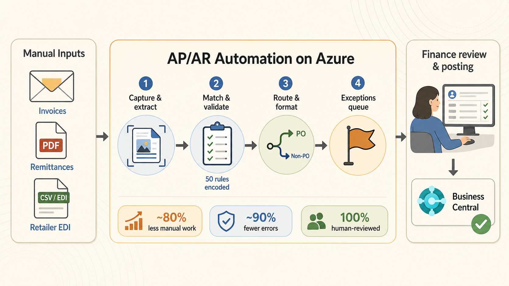
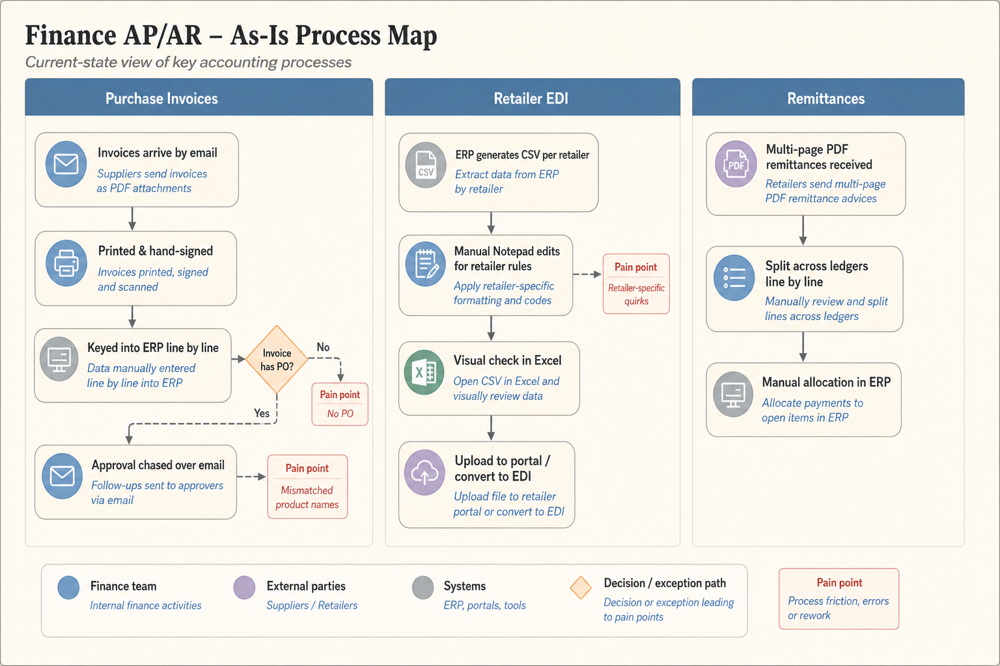

  

    
~80%

    
Of manual AP/AR work automated

  

  

    
~90%

    
Fewer errors

  

  

    
50

    
Manual rules streamlined

  

  

    
100%

    
Human-reviewed before posting

  

**Client:** Mid-market Irish manufacturer.

**Industry:** CPG, frozen foods.

**My Role:** Led the engagement at Tecknoworks.

---

In the [previous case study](/case-studies/pain-points-to-funded-roadmap), I described how a two-week AI and data transformation assessment turned a manufacturer's growth ambition into a funded roadmap: 31 severity-ranked pain points, 16 prioritised use cases, and a sequenced plan the board could act on. This article zooms in on the first build from that roadmap — the one the assessment ranked among the highest-impact opportunities in the business: finance AP/AR automation.

The finance function was a growth ceiling. The team hand-keyed 300 to 400 purchase invoices a month, chased approvals over email, split multi-page remittances line by line, and edited retailer EDI files in Notepad — 24 to 28 hours of manual work per week across the AP process alone. Double the business, as the client intended to by 2030, and that workload doubles with it. This is how we took that process from manual to roughly 80% automated, in production, with the finance team running it day to day — four months from first interview to production.

## Step 1: Interview the People Who Do the Work

We started with structured interviews with the SMEs who actually run the process — the finance manager, the AP specialist, and the sales ledger — watching the real work being done rather than asking how it should work in theory.

The interviews surfaced the detail that never shows up in a requirements document. Each retailer had its own EDI formatting rules — a date adjusted here, an extra zero padded in there — applied by hand in Notepad before every upload, where a single typo could silently bounce an invoice for months. Remittances arrived as PDFs up to 30 pages long and took anywhere from 5 minutes to 2.5 hours each to split across ledgers by hand.

They also explained why the client's previous automation attempt had failed: an invoice OCR tool bought years earlier was abandoned because supplier item names never matched the names in the ERP — it was quicker to key invoices on manually. That lesson shaped the entire design: extraction is the easy part; matching and exceptions are where AP automation lives or dies.

## Step 2: Map the As-Is Process

From the interviews we built as-is process maps for each workflow — purchase invoice processing, retailer EDI submissions, and remittance allocation — with swimlanes for every actor, decision points, time estimates per step, and pain points flagged. Then we validated the maps with the SMEs, who corrected them ("oh, I forgot about the step where…") until they matched reality.

This step matters more than it looks. People describe the process they are supposed to run; the map captures the one they actually run, including the workarounds and exception paths. Those exception paths — the mismatched product names, the retailer-specific quirks, the invoices with no purchase order — became the core of the solution design.

## Step 3: Redesign the Process Before Automating It

The biggest mistake in automation is automating the process you found. We applied the Process Redesign Framework built during the assessment — Question, Simplify, To-Be Map, Test — to redesign the process first, and only then apply technology.

**Question:** every step in the as-is map had to justify its existence. Why does every invoice get printed and physically signed? Why is the approval chased over email? Which steps exist because of a real control requirement, and which because someone asked for them years ago?

**Simplify:** steps that were fundamentally unnecessary were deleted, not automated — printed remittance PDFs, physical signatures, manual email chasing. What survived was standardized: one digital approval workflow instead of ad-hoc email threads, and the retailer-specific EDI rules pulled out of the team's heads and Notepad habits into an explicit, versioned rule set. Across matching, formatting, validation, and exception handling, around 50 manual rules that previously lived in people's heads were made explicit, streamlined, and encoded into the system.

Alongside the redesign, the Build-vs-Buy-vs-Keep-Manual framework settled the technology approach. Enterprise AP platforms would have cost £30–50K per year for a 400-invoice-per-month operation — paying for features the client would never use — and the failed OCR tool had already shown that an off-the-shelf product without a proper matching layer doesn't survive contact with real supplier data. The decision: build custom, on the client's own Azure infrastructure.

**To-Be Map:** the output was a redesigned target process, documented as maps the SMEs signed off on before anything was built. AI document extraction with per-field confidence scores; automatic routing of invoices into PO-matched and approval-based streams; a manager portal for one-click digital approvals; a nightly rule engine for retailer EDI formatting; and exception queues so humans handle only what genuinely needs judgment.

## Step 4: Prototype and Iterate with the SMEs

We didn't disappear for months and return with a finished system — the whole engagement, from first interview to production, took four months. Working from the to-be maps, we drafted a prototype and put it in front of the finance team early, then iterated in tight loops. Every workflow decision was made with the people who would run it: who chooses the approving manager for an unknown supplier, whether the finance manager can override a manager's cost coding, what the canonical order reference is when two systems disagree, which transformation rules are safe to apply automatically. Over roughly three months of working sessions, every major assumption was explicitly confirmed with the SMEs and documented before it was locked into the build.

This is the adoption strategy, not just a design method. The client's previous tools had drifted back to Excel because they were installed rather than adopted. People who help design a system use it. By go-live, the finance team wasn't being handed a new tool — they were receiving the system they had spent three months shaping, tested against real invoices before anything went live.

## Step 5: Implement

The production system runs on the client's own infrastructure: a React front end, Python services on Azure, Azure Document Intelligence for extraction, and a custom extension integrating with their Business Central ERP.

**Accounts Payable.** Supplier invoices arrive by email and are picked up automatically. AI extracts the header and line items with per-field confidence scores, deduplicates (so the same invoice can never be paid twice), matches the supplier against the ERP master list, and routes the invoice: PO-backed invoices go to automated three-way matching with any mismatch flagged by type; non-PO invoices go straight to the responsible manager, who gets a notification, reviews the invoice in a portal, assigns cost codes, and approves in one click — from a phone, in minutes, instead of days of email chasing.

**Accounts Receivable.** Retailer and logistics-partner orders arrive across multiple channels and formats — fixed-width despatch files, EDI CSVs, PDF reports, plain-text emails. The system parses each format, applies deterministic transformation rules, validates against the ERP customer master, and formats outbound retailer EDI files automatically — replacing the nightly Notepad editing entirely. Exceptions land in a resolution queue, and the system learns from them: resolve an unrecognized order pattern once, and every future order matching it is suggested automatically.

**Human-in-the-loop, by design.** The system never auto-posts. Every invoice and every order becomes a draft that a named person reviews and posts in the ERP. Everything upstream of that — ingestion, extraction, matching, formatting, validation, routing — is automated; the judgment call at the end stays human, with a full audit trail of who decided what and when. For a finance function, that is a governance feature, not a limitation.

## The Impact

Measured against the manual baseline, roughly 80% of the manual AP/AR work is gone:

| Stream | Before (manual) | After (measured) | Reduction |
| ------------------- | --------------- | ---------------- | --------- |
| Accounts Payable | ~20–25 hrs/week | ~4–5 hrs/week | ~80% |
| Accounts Receivable | ~20–28 hrs/week | ~4–6 hrs/week | ~80% |

Beyond the hours:

- **~90% fewer errors.** No rekeying, no Notepad edits, systematic deduplication and validation on every document — the typo-bounced invoices discovered months later are gone.
- **50 manual rules streamlined.** Retailer formatting quirks, matching logic, and exception heuristics that lived in the finance team's heads are now explicit, encoded, and maintained in one place — the process no longer depends on any single person's memory.
- **Adopted, not just delivered.** The finance team was trained hands-on and runs the system day to day. The remaining human work is judgment — reviewing exceptions and approving postings — not data entry.

And because the process was redesigned before it was automated, the capacity it freed doesn't just reduce cost — it removes the ceiling. The finance function can now support a business twice the size without growing headcount in lockstep.

## Technology

Microsoft Azure, Azure Document Intelligence, Python, React, PostgreSQL, Microsoft Dynamics 365 Business Central

## Facing the Same Wall?

If your finance team is buried in manual invoice entry, email approvals, and format-fixing that grows with every new customer — I'm happy to talk it through. This is the kind of engagement I lead day to day at [Tecknoworks](https://tecknoworks.com), and a short conversation is usually enough to tell whether an approach like this makes sense for you. Reach out on [LinkedIn](https://www.linkedin.com/in/evgeni-rusev-24636017b/), email me at [evgeni.n.rusev@gmail.com](mailto:evgeni.n.rusev@gmail.com), or contact [Tecknoworks](https://tecknoworks.com/contact/) directly.
