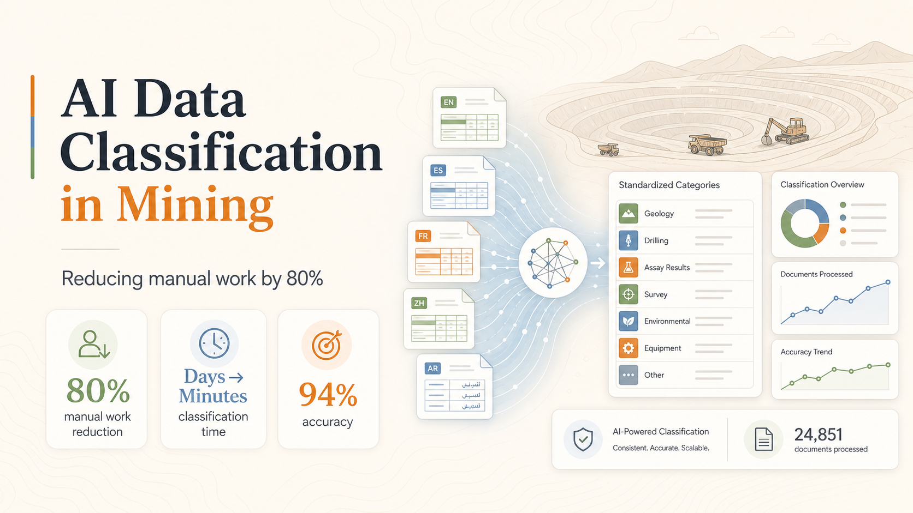

> Originally published on the [Tecknoworks website](https://tecknoworks.com), May 2026.

  

    
80%

    
Manual work reduction

  

  

    
Days → Minutes

    
Classification time

  

  

    
94%

    
Classification accuracy

  

  

    
3 engineers

    
Built the full platform

  

**Client:** Top-three global management consultancy providing operational intelligence to mining companies.

**Industry:** Mining intelligence.

**My Role:** Led the engagement at Tecknoworks.

---

Most teams trying production AI focus on the model. That's the easy part. The hard part is everything around it: the workflow that fits how people actually use the tool, the human review layer that catches what the AI gets wrong, the validation that makes the output trustworthy enough to ship.

This shows up clearly in AI data classification. The model handles one language fine and chokes on the next. Accuracy looks great on a clean test set and collapses on real spreadsheets where the same equipment failure shows up under five different names. Domain experts won't trust the output, so they re-check every row — and the automation saves no time at all. The model isn't where these projects fail. They fail in everything around it: language handling, taxonomy enforcement, review workflows, and the architecture that decides when rules should override predictions.

## The problem: the work that has to happen before the work

Volatile commodity prices and shifting market valuations are pushing mine operators to cut costs and squeeze more from existing operations. Our client built a platform for exactly that — analyzing labor, cost, and equipment-productivity data, benchmarking it against a global peer set, and surfacing where the real improvement opportunities are.

The issue was what had to happen before any of that analysis could begin.

Every mining company records things differently. A truck breakdown might show up as *"Mech Engine"* in one file and *"Avería mecánica del motor"* in another. Different formats, different languages, different terminology. Before any real analysis could start, a consultant had to open each spreadsheet and classify every row into a standard taxonomy. Thousands of rows. By hand.

This happened on every engagement. Consultants were spending days on classification before they could get to the analytical work their clients were actually paying for.

## The bar wasn't accuracy — it was trust

The client wanted to automate classification. But accuracy matters when the output feeds directly into client-facing analysis. A model that gets it right 60% of the time creates more cleanup work than it saves.

They needed a production platform: an AI that classifies across languages, a human review layer so domain experts stay in control, and an interface that fits into how consultants actually work. Upload, map, classify, review, export. No room for missed steps or inconsistent process.

## What we built

Together with the client, we built an 8-step guided workflow that takes raw mine-site spreadsheets and produces analysis-ready datasets. Upload a file, map the relevant columns, and the AI classifies everything in minutes — reducing manual classification work by roughly 80%.

The taxonomy covers real operational depth: **129 cost categories, 33 labor roles, and ~160 equipment delay types across four equipment classes.** The platform handles data in any language, translating before classification and preserving original values for export.

Every AI classification goes through human-in-the-loop review. Consultants see each suggestion, accept or override it, and export a clean dataset. Nothing is finalized without a human decision.

On top of that we built an analytics engine. From classified equipment data, the system generates 13 pre-formatted analysis tables (OEE breakdowns, maintenance reliability, utilization summaries, benchmark comparisons) packaged as a single download.

The accuracy story is worth telling. Equipment-delay classification started at 56% and was improved to **94% at the category level** through prompt engineering, targeted examples, and a hybrid architecture: AI handles granular prediction while a rules engine enforces category-level consistency. During evaluation, the team found 79 cases where the AI was right and the human-labeled training data was wrong.

## Results

- **80% reduction** in manual classification work.
- **94% classification accuracy** at category level (up from a 56% baseline).
- **Days → minutes** per spreadsheet.
- **3 active classification domains** live in production, with a fourth in development.
- **180× fewer AI API calls** via smart deduplication.
- **277 automated tests** covering the full pipeline.

Classification that used to take days now takes minutes. Consultants moved from data entry to quality review. Results are consistent across engagements regardless of source language or site format.

A small team of three engineers built the entire production-grade platform from scratch over 9.5 months: AI classification engine, full-stack web application, cloud infrastructure as code, and a rigorous evaluation framework. The platform runs on a .NET 9 backend on Azure and handles files up to 500 MB.

## The pattern beyond mining

AI data classification isn't a mining problem — it's a production AI problem.

Every organization that collects operational data across multiple sites or regions faces some version of this. Inconsistent formats, different languages, manual standardization that eats time and introduces errors. The bottleneck is always the same: getting from raw data to something you can actually analyze.

The AI classification model was one piece. The production platform around it — the workflow, the validation, the human review, the multilingual support, the analytics engine — is what made it usable at scale.

The AI was the easy part. The trust layer around it is what made the math work.
