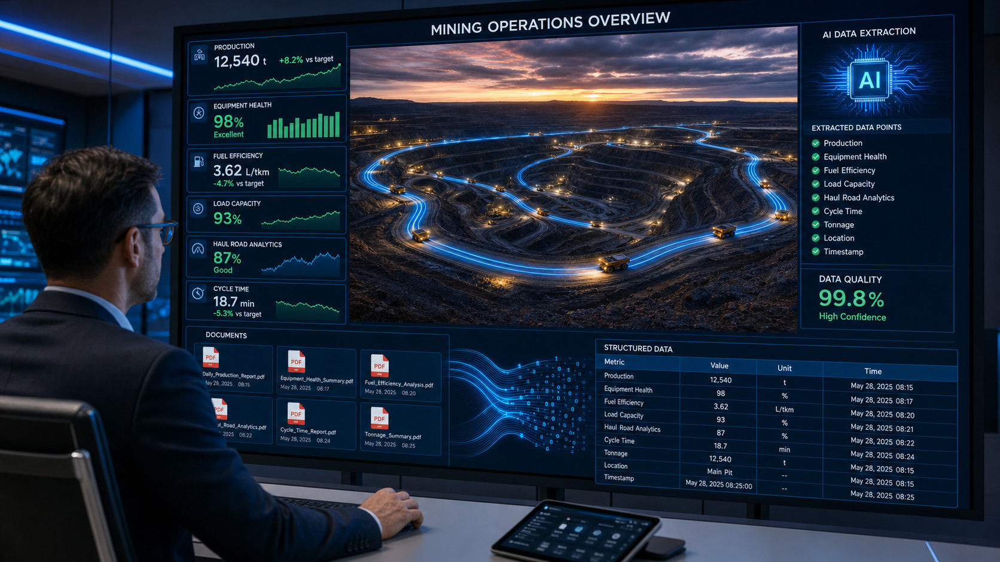

> Originally published on the [Tecknoworks website](https://tecknoworks.com/cases/mining-intelligence-ai-data-extraction/), May 2026. I led this engagement at Tecknoworks.

  

    
80%+

    
Reduction in manual data gathering

  

  

    
100%

    
Source traceability

  

  

    
500+

    
Unit conversion rules

  

  

    
2 weeks

    
Kickoff to production

  

**Client:** Top-three global management consultancy providing operational intelligence to mining companies.
**Industry:** Mining intelligence.

---

Most enterprise data isn't in databases. It's in documents.

Technical reports, mining documents, handwritten notes — the operational knowledge that should be driving decisions sits in file libraries nobody can search efficiently. AI changes that math. The capability isn't experimental anymore; it's a few weeks of focused work, not a moonshot. But the model isn't where these projects live or die.

## The problem: thousands of PDFs, all manually searched

Our client provides operational intelligence to mining companies — production volumes, reserves, recovery rates, development stages. Hundreds of mines, updated regularly. Mining executives rely on this data to make real decisions about where to invest, where to cut, and where the gaps are in their operations.

But getting to the data was slow.

Every day, a team of analysts opened a PDF search software and started hunting. Thousands of documents. A data point buried in a table on page 47, or halfway through a technical report. If it wasn't there, open the next document. And the next. Multiple people doing this, all day, across hundreds of mine records.

They were paying for an expensive PDF subscription just to search. And still falling behind on coverage.

## The solution: a production layer around the AI

We didn't rebuild the AI; we improved it and built everything around it.

The agentic AI component connects to the full document library. When an analyst opens a mine record, the relevant fields are already populated — each tagged with source document, page, and section. A confidence indicator tells analysts which values to trust and which to double-check. One click to accept. Edit if something's off. Full audit trail either way.

The trust layers that made the system production-grade:

- **Validation** that catches bad values before a reviewer sees them
- **Confidence scoring** so analysts know which fields to trust on sight
- **Unit standardization** across 500+ conversion rules
- **Audit trails** that survive every edit
- **A senior review workflow** before data hits production

Without those layers, the "AI solution" would have sat next to the existing process instead of replacing it, and the cost would have stayed.

The whole system went live in two weeks. Not a pilot — production, with real data and real analysts using it from day one.

## What changed

Manual data gathering time dropped by over 80%. Analysts shifted from searching to reviewing. The PDF software subscription got cancelled. Every data point now traces back to its exact source — which was impossible to maintain consistently by hand.

The client's roadmap now includes scheduled AI extraction runs and self-learning feedback loops, built on the infrastructure we delivered.

## Looking beyond the model

The AI was 20% of the problem. The other 80% was production engineering: making the model work inside an existing product, with real validation, real traceability, and a UI that analysts actually trust.

This pattern shows up everywhere. Organizations invest in AI capabilities that perform well in isolation. The models work. The demos are convincing. But when it's time to connect that capability to production systems, handle real-world data at scale, and deliver results people can verify and act on, the investment stalls. The gap between a working model and a working product is almost always an engineering problem, not an AI problem.

The question is rarely whether the model is good enough. It usually is. The question is whether the production infrastructure exists to make it trustworthy at scale.

The AI was the easy part. Building the trust layer around it is what made the math work.
