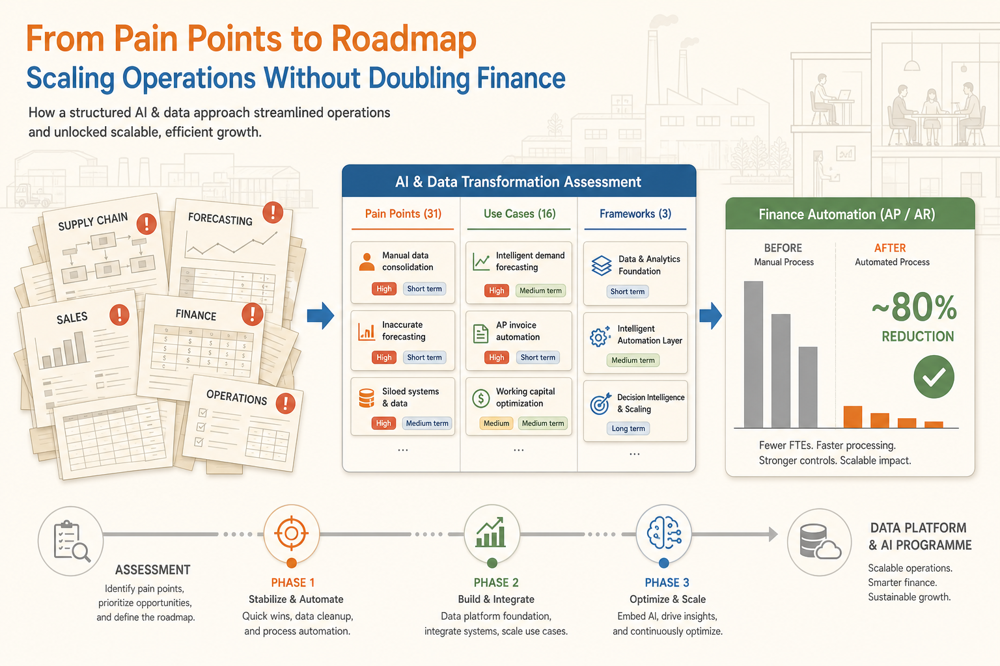
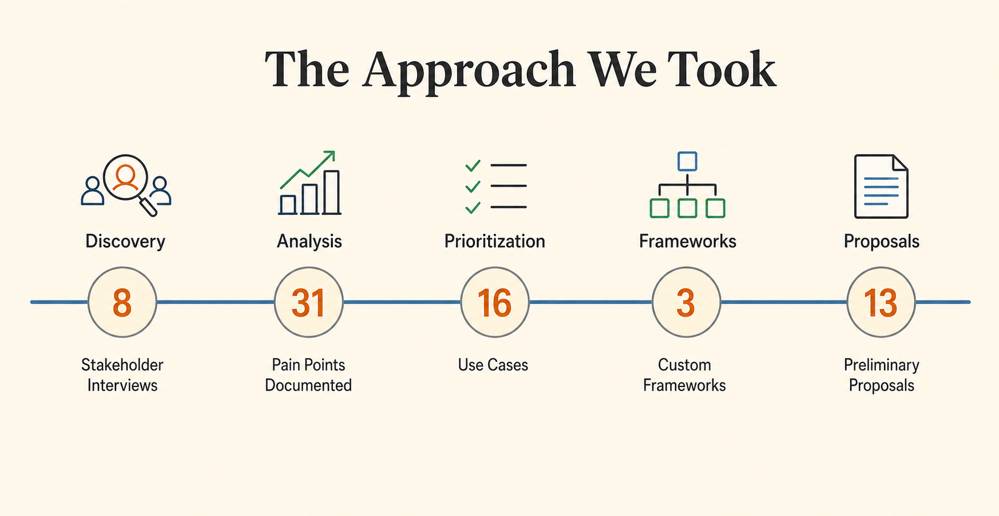
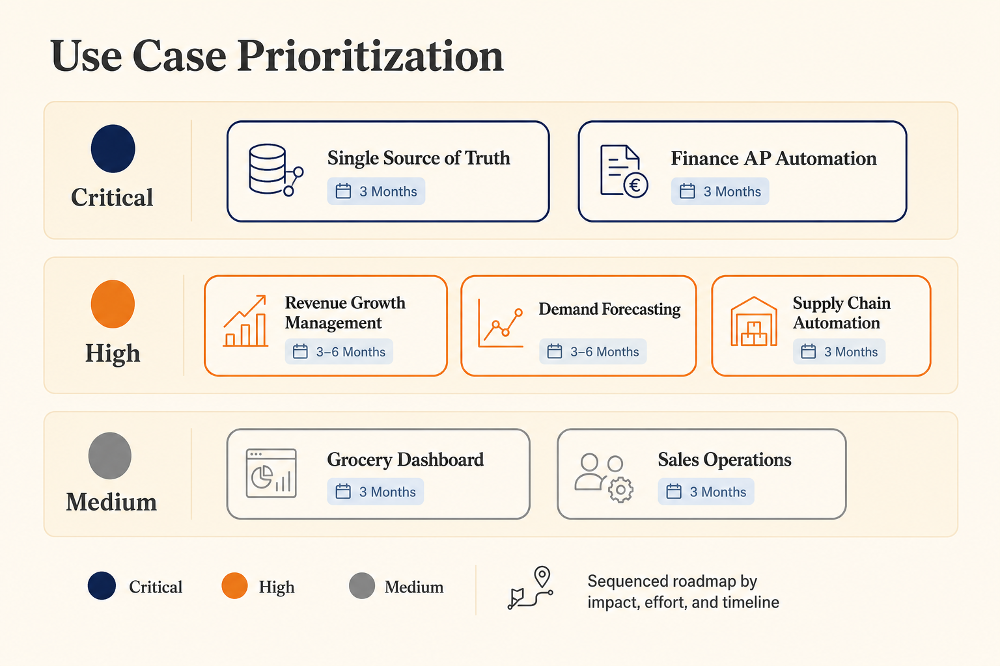

  

    
31

    
Pain points severity-ranked

  

  

    
16

    
Use cases prioritised

  

  

    
2 weeks

    
Assessment to board-ready roadmap

  

  

    
~80%

    
Less finance processing time, in production

  

**Client:** Mid-market Irish manufacturer.

**Industry:** CPG, frozen foods.

**My Role:** Led the engagement at Tecknoworks.

---

A mid-market manufacturer set out to roughly double in size by 2030. To support that growth, it wanted to optimise the core processes behind its supply chain, finance, and forecasting so they could scale with the business. A two-week AI and data transformation assessment turned that ambition into a sequenced, board-ready roadmap: 31 ranked pain points, 16 prioritised use cases, and three custom decision frameworks. The first build from that roadmap — finance automation covering AP and AR — is now live in production on the client's own infrastructure and has cut finance processing time by roughly 80%.

## The Challenge

The client is an established manufacturer with strong, long-standing retailer relationships and a clear target: roughly double the business by 2030. The strategy was not the problem. The problem was that the day-to-day operating model — the way plans, forecasts, orders, and invoices actually got made — ran on manual effort that grows in lockstep with revenue. Double the business and you double the workload, and you cannot hire your way out of that.

The assessment catalogued 31 distinct pain points, and every one traced back to the same meta-problem: no single source of truth, so Excel had become the company's de facto operating layer. The evidence ran across every function. The supply-chain lead spent more than 7 hours a day planning production in spreadsheets — roughly 14 hours a day at twice the revenue. Demand forecasting was entirely manual, consuming 5 to 20 hours per update cycle. Finance keyed 300 to 400 purchase invoices a month by hand and edited retailer EDI files line by line in Notepad, where a single typo could silently bounce an invoice, sometimes discovered months later when a retailer did not pay.

On top of the workload sat a decision-making gap. Millions in retailer promotions were managed through a 400-line manual workbook, with no reliable way to separate a good promotion from a bad one, and years of paid market-research data sat underused. This was the gap the CEO described as being unable to "see around corners": the data to make faster, better decisions existed, but sat disconnected across the business.

This was not a company that had refused to invest in tools — it had bought planning and forecasting systems and tried invoice OCR years earlier. But with no integrated data foundation underneath, teams reverted to spreadsheets and the tools sat idle. Meanwhile, the retailers across the negotiating table were already deploying AI. The manufacturer needed an AI-ready data foundation of its own to meet them on equal footing.

## The Approach

Tecknoworks structured the engagement so that each phase earned the next: a discovery assessment first, then a focused implementation that proved value on real invoices, and only then a costed blueprint for the full data platform, put in front of the board once the foundation for it was mapped. The client committed to each step on the strength of the one before.

### Phase 1: Assessment and Roadmap — delivered

A structured two-week AI and data transformation assessment. The methodology was the deliverable. The team ran SME interviews across 8 functional areas, including finance, supply chain, commercial, IT, leadership, and quality. It documented and severity-ranked 31 pain points, then mapped and prioritised 16 use cases by impact, investment, and timeline.

Three reusable decision frameworks were built for the client: Build-vs-Buy-vs-Keep-Manual, Process Redesign (do not automate a broken process), and a 6-stage implementation framework with human-in-the-loop governance. Alongside the frameworks, a multi-year financial model projected the cost and return of each initiative, backing every decision with numbers. The outcome was a funded, sequenced plan that put the highest-value moves first.

### Phase 2: Finance Automation and Data Discovery — delivered

Two parallel workstreams.

The first is finance automation covering Accounts Payable and Accounts Receivable, built on the client's own infrastructure and tested with real invoices before go-live. The design principle is human-in-the-loop. The system never auto-posts, and the finance team always reviews before anything is committed. Its components are AI document extraction, automated purchase-order matching, an approval workflow that chases managers automatically, and a rule engine that formats and validates retailer EDI files.

The system is now in production and operational — and, just as importantly, adopted. The finance team was trained hands-on by the Tecknoworks delivery team and runs the system day to day. For a business whose previous tool investments had drifted back to Excel, adoption was treated as part of the build, not an afterthought.

The second workstream mapped the full data estate and produced the blueprint for what comes next: a technical architecture for a centralised data platform, the foundation every later capability depends on.

### Phase 3: Centralised Data Platform and AI Programme — upcoming

The blueprint from Phase 2 defines what comes next: a Microsoft Fabric lakehouse consolidating 12 data sources into one source of truth, a revenue growth management app that gives real ROI visibility on promotional spend, a machine-learning demand-forecasting engine trained on the client's own history, and automated collection of the retailer sales signal currently stranded in retailer portals.

## Outcomes

### Delivered: from "we don't know where to start" to a sequenced plan

The two-week assessment was the solution the client needed first. In that time it turned a broad growth ambition into a costed, prioritised, board-ready plan:

- 8 functional areas assessed.
- 31 pain points documented and severity-ranked.
- 16 use cases prioritised by impact, investment, and timeline.
- 3 custom decision frameworks the client keeps and reuses.
- A costed, multi-year financial model behind the plan.

Leadership knew which moves to make, in what order, and what each one was worth. The first phase of the roadmap was funded on that clarity, and everything since has been execution against it.

### Delivered: roughly 80% less manual finance work, measured in production

The first build from the roadmap is live: AP/AR automation in production on the client's own infrastructure, alongside the full data-estate map and platform architecture. Measured against the manual baseline, finance processing time is down roughly 80% across both AP and AR:

| Stream | Before (manual) | After (measured) | Reduction |
| ------------------- | --------------- | ---------------- | --------- |
| Accounts Payable | ~20–25 hrs/week | ~4–5 hrs/week | ~80% |
| Accounts Receivable | ~20–28 hrs/week | ~4–6 hrs/week | ~80% |

The hours are only part of it: around 50 manual rules — retailer-specific formatting quirks, matching logic, exception handling — were streamlined and encoded into the system, and errors are down roughly 90%, with no rekeying and systematic validation on every document.

This is not a pilot or a projection — it is an operational system the finance team runs day to day, trained hands-on and reviewing every entry before anything posts. I've written a full deep dive on how this was built — from SME interviews and as-is process maps to redesign, prototyping, and production — in [Automating 80% of Finance AP/AR with AI](/case-studies/automating-finance-ap-ar-with-ai).

## What's Possible Now

Before the engagement, leadership held a growth ambition and a wide set of possible initiatives to prioritise. Now it holds a costed, sequenced roadmap with clear go and no-go decision points, finance automation running in production with a measured 80% reduction in processing time, and a data-platform architecture ready to build next.

Once the roadmap is executed, the manufacturer can move to daily retailer invoicing instead of weekly or monthly, clear approvals in under a day, ask its data questions in plain English from anywhere, and grow toward twice its size without doubling its finance and operations team.

## Technology

Microsoft Azure, Microsoft Fabric, Power BI, Python, React, Next.js, FastAPI

## Facing a Similar Ceiling?

If your growth plan is running into the same wall — processes that scale linearly with revenue, data scattered across spreadsheets, tools your teams never adopted — I'm happy to talk it through. This is the kind of engagement I lead day to day at [Tecknoworks](https://tecknoworks.com), and a short conversation is usually enough to tell whether an assessment like this makes sense for you. Reach out on [LinkedIn](https://www.linkedin.com/in/evgeni-rusev-24636017b/), email me at [evgeni.n.rusev@gmail.com](mailto:evgeni.n.rusev@gmail.com), or contact [Tecknoworks](https://tecknoworks.com/contact/) directly.
