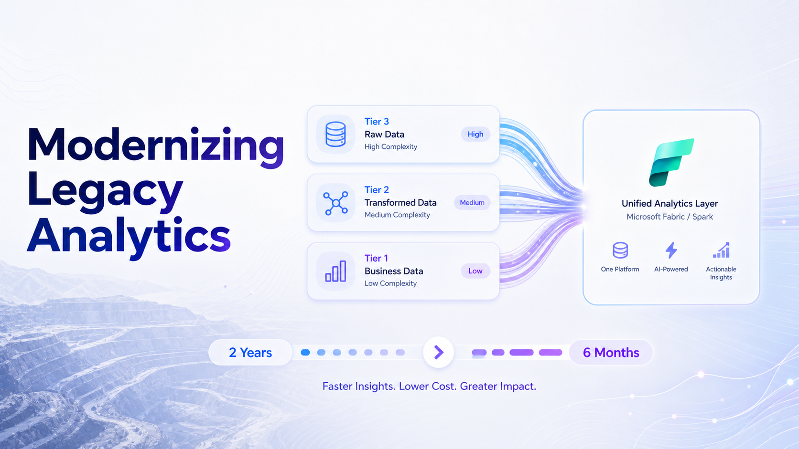

<div class="not-prose my-10 grid grid-cols-2 gap-4 sm:grid-cols-4">
  <div class="rounded-lg border border-border p-5 text-center">
    <div class="text-3xl font-bold text-accent">1,700+</div>
    <div class="mt-2 text-sm opacity-80">Stored procedures migrated</div>
  </div>
  <div class="rounded-lg border border-border p-5 text-center">
    <div class="text-3xl font-bold text-accent">800+</div>
    <div class="mt-2 text-sm opacity-80">C# calculations migrated</div>
  </div>
  <div class="rounded-lg border border-border p-5 text-center">
    <div class="text-3xl font-bold text-accent">4×</div>
    <div class="mt-2 text-sm opacity-80">Faster than the manual estimate</div>
  </div>
  <div class="rounded-lg border border-border p-5 text-center">
    <div class="text-3xl font-bold text-accent">6 months</div>
    <div class="mt-2 text-sm opacity-80">Total delivery</div>
  </div>
</div>

**Client:** Top-three global management consultancy providing operational intelligence to mining companies.

**Industry:** Mining intelligence.

**My Role:** Led the design and adoption of the AI-accelerated migration methodology at Tecknoworks.

---

A decade-old codebase. 1,700 SQL stored procedures and 800 C# calculations driving the platform's daily analytics — the calculations mining executives rely on for production volumes, reserves, recovery rates, and operational benchmarking. Performance had become the bottleneck: the full calculation pass took **over 24 hours** to run end-to-end. The platform needed to migrate the whole stack to Microsoft Fabric (Spark SQL) so the workload could scale.

The internal estimate was **2+ years with a team of 5**. We delivered it in **6 months** by partitioning 2,500 migration units across three complexity tiers and applying tier-specific AI-accelerated workflows — automating the bulk of the work without sacrificing review discipline on the parts that needed it.

## The problem: 2,500 calculations to migrate, no two quite alike

1,700 in SQL, 800 in C#. A migration like this isn't one problem. It's three.

- **Low-complexity logic** — straightforward queries that map nearly line-by-line to Spark SQL. The bulk of the codebase, cheap per item.
- **Medium-complexity procedures** — multi-step procedural SQL with temp tables, conditional branches, and dynamic shaping. Translation isn't mechanical; you have to understand intent before you can re-express it.
- **High-complexity C# calculations** — stateful, iterative business logic that doesn't translate cleanly to a parallel execution model. These need re-architecture, not translation.

Treating all three the same is the trap — and it's where the 2-year estimate came from. Hand-translate every line, with senior engineers babysitting the trivial work alongside the hard.

## The approach: classify first, then automate per tier

The first move was a lightweight upfront audit that classified every procedure and calculation into one of the three tiers — [MECE-style](https://en.wikipedia.org/wiki/MECE_principle): mutually exclusive, collectively exhaustive. That audit alone changed the economics. Roughly 70% of the codebase landed in Tier 1, 20% in Tier 2, and only 10% in Tier 3. We knew exactly where the senior time was needed before writing a line of migration code.

The second move was building tier-specific migration workflows around an AI-augmented developer loop:

- **Instruction files** — migration patterns, gotchas, and conventions codified per tier, so the AI applied the right strategy automatically when a developer pointed it at a unit of work. The instruction files were a living asset: every recurring mistake the AI made on a reviewed translation became a new rule in the file. As the codebase moved through review, the AI's first-pass output progressively drifted *less* from what reviewers would accept — fewer corrections, less rework, faster batch sign-off.
- **Tier-specific prompting** — the upfront classification was also the prompting strategy. Each tier had its own prompt template with the right context, the right examples, and the right review checklist. No "translate this" prompts; every prompt knew which tier it was solving.
- **Reusable templates** — input-pattern → Spark-output scaffolding pairs that the AI matched against and adapted, instead of regenerating from scratch every time.
- **Tier-specific review workflows** — automated output-equivalence regression tests for Tier 1; pair-review with the AI for Tier 2; senior-architect-led review for every Tier 3 item.

The methodology was the unlock. Once it was in place, the team's senior time concentrated where it mattered, and the LLM carried the long tail.

## What the three tiers actually look like

Approximate, anonymized patterns. The client's real procedures are 5-20× longer and domain-specific — these capture the *structural shape* of each tier, which is what determined the migration strategy.

### Tier 1 — Low complexity (~70% of the codebase)

Straightforward aggregation procedures that map almost 1:1 to Spark SQL.

```sql
-- Pattern: stage → filter → aggregate → persist
CREATE PROCEDURE Calc_DailyMetrics_<entity>
  @<period> DATE
AS
BEGIN
  INSERT INTO <output_table>
  SELECT
    <dim_columns>,
    SUM(<metric>) AS total,
    AVG(<metric>) AS avg_value
  FROM <staging_table>
  WHERE <filter_clause>
  GROUP BY <dim_columns>
END
```

The LLM produced the Spark SQL conversion, the output-equivalence regression test ran against the source-of-truth dataset, and the vast majority passed on first attempt. Engineers reviewed in batches instead of one-by-one. The Tier 1 workflow effectively ran itself.

### Tier 2 — Medium complexity (~20%)

Multi-step procedures with temp tables, conditional branching, and reshaping logic.

```sql
-- Pattern: stage → branch on business rule → reshape → output
CREATE PROCEDURE Calc_<DomainCalculation>
  @<rule_param> NVARCHAR(50),
  @<period> DATE
AS
BEGIN
  -- Step 1: stage the relevant slice
  CREATE TABLE #stage ( /* ...columns... */ )
  INSERT INTO #stage SELECT ... WHERE ...

  -- Step 2: apply rule branches
  IF @rule_param = '<rule_a>'
    UPDATE #stage SET <col> = <rule_a_expression>
  ELSE IF @rule_param = '<rule_b>'
    UPDATE #stage SET <col> = <rule_b_expression>

  -- Step 3: pivot for downstream consumption
  SELECT ... FROM #stage
  PIVOT (SUM(<metric>) FOR <category> IN (<list>)) AS p
END
```

The LLM translated the SQL, but a human had to verify *intent*. Temp tables become Spark DataFrames; conditional branches become functional `when/otherwise` clauses; pivots have semantic gotchas around sparse categories. The reviewer confirmed the dataflow matched the original logic, not just the syntax. AI carried ~80% of the lift; human review carried the remaining 20% that actually mattered.

### Tier 3 — High complexity (~10%)

Stateful, iterative C# logic that doesn't survive a literal translation to a parallel execution model.

```csharp
// Pattern: state-carrying iteration with branching domain math
public class <DomainCalculator>Engine
{
    public IEnumerable<Result> Calculate(
        IEnumerable<InputRow> rows,
        ConfigContext ctx)
    {
        var state = InitState(ctx);
        var output = new List<Result>();

        // Each row's result depends on accumulated state from prior rows
        foreach (var row in rows.OrderBy(r => r.<sortKey>))
        {
            state = ApplyTransition(state, row, ctx);

            // Domain-specific math (~50-100 lines of branching business rules)
            if (state.<flag>) state = AdjustFor<Condition>(state, row);

            var result = ComputeForRow(row, state, ctx);
            output.Add(result);
        }

        return output;
    }
}
```

This is where AI assists rather than automates. Sequential state-passing has to become window functions for some patterns, scan/aggregate operations for others, and Spark UDFs for irreducibly-sequential logic. The senior engineer and the LLM worked the re-architecture together: the LLM accelerated the first draft and surfaced design questions; the architectural call always belonged to a human.

## Results

- **Original estimate** — 24+ months, team of 5.
- **Delivered** — 6 months.
- **Tier 1 automation** — ~100% (quick-glance review thanks to near-100% first-pass accuracy).
- **Tier 2 automation** — ~80% (AI-assisted, human-reviewed).
- **Tier 3 automation** — ~50% (AI-assisted, human-architected).

Calculation runtime dropped from **24+ hours to a few hours** on the new Fabric platform. The platform now carries analytics workloads the legacy SQL stack couldn't support — and the migration methodology became a reusable internal asset for the next data-platform modernization.

## Reflection

The instinct on a migration like this is to scale up the team. AI changes that math — but only if you partition first. Without the tier classification, AI would have been used uniformly across the codebase, producing two predictable failure modes: under-reviewed Tier 3 code and over-reviewed Tier 1 code, neither of which compounds.

The tier breakdown is what made the automation mix sensible — full automation where it was safe, structured pair-review where it wasn't, and senior architecture time concentrated on the 10% that actually needed it.

This pattern shows up in most large-scale legacy migrations. The real win isn't *AI translates code*. It's *AI translates the easy 90%, so humans can focus on the hard 10%* — which is where the architecture lives anyway.
